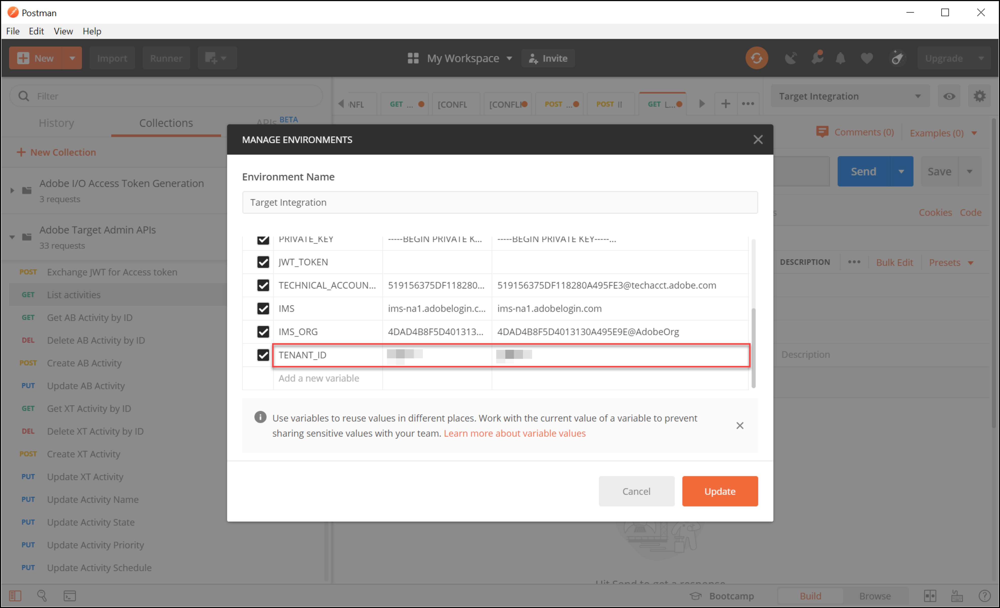

# 設定[!DNL Adobe Target] API的驗證

[!DNL Adobe Target] Admin API （包括[!DNL Recommendations Admin] API）受到驗證保護，以確保只有授權的使用者才能使用它們來存取[!DNL Adobe Target]。 使用[Adobe Developer Console](https://developer.adobe.com/console/home)管理所有[!DNL Adobe Experience Cloud solutions]的此驗證，包括[!DNL Adobe Target]。

>[!IMPORTANT]
>
>本文所述的服務帳戶(JWT)憑證將遭取代，以支援新的OAuth伺服器對伺服器憑證。
>
>服務帳戶(JWT)憑證將繼續使用至2025年1月1日。 您必須移轉應用程式或整合，才能在2025年1月1日之前使用新的OAuth伺服器對伺服器認證。
>
>如需移轉整合的詳細資訊和逐步指示，請參閱&#x200B;*Developer Console*&#x200B;檔案中的[從服務帳戶(JWT)認證移轉至OAuth伺服器對伺服器認證](https://developer.adobe.com/developer-console/docs/guides/authentication/ServerToServerAuthentication/migration/){target=_blank}。
>
>如需設定新OAuth認證的資訊，請參閱&#x200B;*Developer Console*&#x200B;檔案中的[OAuth伺服器對伺服器認證實作](https://developer.adobe.com/developer-console/docs/guides/authentication/ServerToServerAuthentication/implementation/){target=_blank}。

以下是產生成功與[!DNL Adobe Target] API互動所需的舊版JWT驗證權杖所需的初步步驟：

1. 在[!DNL Adobe Developer Console]中建立專案（先前稱為整合）。
1. 將專案詳細資料匯出至Postman。
1. 產生持有者存取權杖。
1. 測試持有者存取權杖。

## 先決條件

| 資源 | 詳細資料 |
| --- | --- |
| Postman | 為了成功完成這些步驟，請取得您作業系統的[Postman應用程式](https://www.postman.com/downloads/)。 Postman basic可免費建立帳戶。 雖然一般而言使用[!DNL Adobe Target] API並不需要，但Postman可讓API工作流程更輕鬆，[!DNL Adobe Target]提供多個Postman集合以協助執行其API並瞭解其運作方式。 本指南的其餘部分假設您具備Postman的工作知識。 如需協助，請參閱[Postman檔案](https://learning.getpostman.com/)。 |
| 參考 | 在本指南的其餘部分中假設您熟悉以下資源：<ul><li>[Adobe I/O的Github](https://github.com/adobeio)</li><li>[Target管理員和設定檔API檔案](../administer/admin-api/admin-api-overview-new.md)</li><li>[Recommendations API檔案](https://developer.adobe.com/target/administer/recommendations-api/)</li></ul> |

## 建立Adobe I/O專案

在此區段中，您將存取[!DNL Adobe Developer Console]並建立[!DNL Adobe Target]的專案。 如需詳細資訊，請參考專案](https://developer.adobe.com/developer-console/docs/guides/projects/)上的[檔案。

&lt;！—(1. 根據有關驗證](https://developer.adobe.com/developer-console/docs/guides/authentication/)的[檔案產生您的私密金鑰和公開憑證。 // [//]： # （如[的&#x200B;**步驟1**&#x200B;中所述）如何設定AdobeIO：驗證 — 逐步進行](https://helpx.adobe.com/marketing-cloud-core/kb/adobe-io-authentication-step-by-step.html)。 完成步驟1後，請返回本指南並繼續執行以下步驟2。//此步驟的結果應該是建立`private.key`檔案和`certificate_pub.crt`檔案。 產生這兩個檔案之後，請回到本指南。)—>

1. 在[Adobe Admin Console](https://adminconsole.adobe.com/)中，確定您的[!DNL Adobe]使用者帳戶已同時授予[!DNL Target]的[產品管理員](https://helpx.adobe.com/enterprise/using/admin-roles.html)和[開發人員](https://helpx.adobe.com/enterprise/using/manage-developers.html)層級存取權。

1. 在[Adobe Developer Console](https://developer.adobe.com/console/home)中，選取您要建立此整合的[!UICONTROL Experience Cloud Organization]。 （請注意，您可能只能存取單一[!UICONTROL Experience Cloud Organization]。）

   

1. 按一下 **[!UICONTROL Create new project]**。

   

1. 按一下&#x200B;**[!UICONTROL Add API]**&#x200B;將REST API新增至您的專案，以存取[!DNL Adobe]服務和產品。

   

1. 選取&#x200B;**[!DNL Adobe Target]**&#x200B;作為您想要整合的[!DNL Adobe]服務。 按一下出現的&#x200B;**[!UICONTROL Next]**&#x200B;按鈕。

   

1. 選取將公開金鑰和私密金鑰與您要為[!DNL Target]建立的服務帳戶整合建立關聯的選項。 在此範例中，選取&#x200B;**[!UICONTROL Option 1: Generate a key pair]**&#x200B;並按一下&#x200B;**[!UICONTROL Generate keypair]**。

   

1. 依照指示，記下自動下載的組態檔(`config`)，其中包含您的私密金鑰。 按一下 **[!UICONTROL Next]**。

   

1. 在您的檔案系統中，確認`config`的位置，這是在上一步建立的壓縮組態檔。 同樣地，此`config`檔案包含您的私密金鑰，稍後您將需要這些金鑰。 檔案系統內的確切位置可能與此處顯示的位置不同。

   

1. 返回Adobe Developer Console，選取與您使用Adobe Recommendations的屬性相對應的[產品設定檔](https://helpx.adobe.com/enterprise/using/manage-products-and-profiles.html)。 (如果您未使用屬性，請選取「預設Workspace」選項)。 按一下 **[!UICONTROL Save configured API]**。

   

1. 按一下&#x200B;**[!UICONTROL Create Integration]**。 您應該會收到暫時訊息，指出您的API已成功設定。
1. 最後一個步驟，請將專案重新命名為比原始`Project 1`更有意義的名稱。 若要這麼做，請使用導覽路徑顯示來導覽至專案，按一下&#x200B;**[!UICONTROL Edit project]**&#x200B;以存取&#x200B;**[!UICONTROL Edit Project]**&#x200B;強制回應視窗，然後重新命名專案。

   

>[!NOTE]
>
>在此範例中，我們將專案命名為「[!DNL Target]整合」。 如果您預計使用專案的時間會超過[!DNL Adobe Target]，建議您據以命名。 例如，您可能會選擇將其命名為「AdobeAPI」或「Experience CloudAPI」，因為它可與Adobe Experience Cloud中的其他解決方案搭配使用。

## 匯出專案詳細資料

現在您已擁有可用於存取[!DNL Target]的Adobe專案，您必須確定已連同您的AdobeAPI要求一起傳送該專案的詳細資料。 需要這些詳細資料才能與多個AdobeAPI互動，包括多個[!DNL Target] API。 例如，整合詳細資料包含[!DNL Target] Admin API所需的授權和驗證資訊。 因此，若要搭配Postman使用API，您必須將這些詳細資料帶入Postman。

有許多方式可在Postman中指定您專案的詳細資料，但在本節中，我們利用了某些預先建立的功能和集合。 首先（在本節中），您會將整合的詳細資訊匯出至Postman環境。 接下來（在以下區段中），您將產生持有者存取權杖，以授予您存取必要Adobe資源的許可權。

>[!NOTE]
>
>如需適用於任何Experience Cloud解決方案（包括[!DNL Target]）的視訊指示，請參閱[使用Postman搭配Experience PlatformAPI](https://experienceleague.adobe.com/docs/platform-learn/tutorials/platform-api-authentication.html)。 以下區段與[!DNL Target] API有關： 1. 建立Experience Platform API並將其匯出至Postman 2。 使用Postman產生存取權杖。 以下也提供這些步驟。

1. 仍然在[Adobe Developer Console](https://developer.adobe.com/console/home)中，瀏覽以檢視您新專案的&#x200B;**[!UICONTROL Service Account (JWT)]**&#x200B;認證。 使用左側導覽或&#x200B;**[!UICONTROL Credentials]**&#x200B;區段，如圖所示。

   

   在&#x200B;**[!UICONTROL Credential details]**&#x200B;中，請注意，您可以檢視您的&#x200B;**[!UICONTROL Public key(s)]**、**[!UICONTROL Client ID]**&#x200B;以及與您的服務帳戶相關的其他資訊。

   

1. 按一下以瀏覽至&#x200B;**[!DNL Adobe Target]** API的相關資訊。 使用左側導覽或&#x200B;**連線的產品和服務**&#x200B;區段，如圖所示。

   

1. 按一下「**[!UICONTROL Download for Postman]** > **[!UICONTROL Service Account (JWT)]**」以建立擷取Postman環境驗證資訊的JSON檔案。

   

   請記下檔案系統中的JSON檔案。

   

1. 在Postman中，按一下齒輪圖示來管理您的環境，然後按一下&#x200B;**[!UICONTROL Import]**&#x200B;匯入JSON檔案（環境）。

   

1. 選擇您的檔案並按一下&#x200B;**[!UICONTROL Open]**。

   

1. 在Postman **管理環境**&#x200B;強制回應視窗中，按一下新匯入的環境名稱以進行檢查。 (您的環境名稱可能與此處顯示的名稱不同。 視需要編輯名稱。 它不一定要與[!DNL Adobe]專案的名稱相符。)

   

1. 注意`CLIENT_SECRET`和`API_KEY` （以及其他變數）已預先填入其值，取自您在Adobe Developer Console中定義的整合。 (Postman `CLIENT_SECRET`變數應符合Developer Console中顯示的`CLIENT SECRET`個Adobe認證，而Postman中的`API_KEY`也應符合Developer Console中的`CLIENT ID`。) 相較之下，`PRIVATE_KEY`、`JWT_TOKEN`和`ACCESS_TOKEN`則為空白。 讓我們從提供`PRIVATE_KEY`值開始。

   

1. 從您的檔案系統開啟`config`檔案，然後開啟`private`金鑰檔案。

   

1. 選取並複製`private`金鑰檔案的整個內容。

   

1. 在Postman中，將您的私密金鑰值貼到&#x200B;**[!UICONTROL INITIAL VALUE]**&#x200B;和&#x200B;**[!UICONTROL CURRENT VALUE]**&#x200B;欄位中。

   

1. 按一下&#x200B;**[!UICONTROL Update]**，然後關閉環境強制回應視窗。

## 產生持有者存取權杖

在本節中，您會產生持有者存取權杖，這是驗證您與[!DNL Adobe Target] API的互動所需的權杖。 若要產生持有者存取權杖，您必須將整合詳細資訊（建立於上述章節）傳送至[AdobeIdentity Management服務(IMS)](https://www.adobe.io/authentication/auth-methods.html#!AdobeDocs/adobeio-auth/master/AuthenticationOverview/AuthenticationGuide.md)。 有幾種方法可以達成此目的，但在本指南中，我們利用了包含預先建立IMS呼叫的Postman集合，讓程式簡單明瞭。 匯入集合後，您可以視需要重複使用，不僅為[!DNL Adobe Target]產生新權杖，也為其他AdobeAPI產生新權杖。

1. 導覽至[AdobeIdentity Management服務API範例呼叫](https://github.com/adobe/experience-platform-postman-samples/tree/master/apis/ims)。

   

1. 按一下&#x200B;**[!UICONTROL Adobe I/O Access Token Generation Postman collection]**。

   

1. 按一下&#x200B;**[!UICONTROL Raw]**，然後將產生的JSON複製到剪貼簿，以取得此集合的原始JSON。 （您也可以將原始JSON儲存為.json檔案。）

   

1. 在Postman中，透過貼上並從剪貼簿提交原始JSON來匯入集合。 （您也可以上傳已儲存的.json檔案）。 按一下 **[!UICONTROL Continue]**。

   

1. 在Adobe I/O存取權杖產生Postman集合中選取&#x200B;**[!UICONTROL IMS: JWT Generate + Auth via User Token]**&#x200B;要求，確定已選取您的環境，然後按一下&#x200B;**[!UICONTROL Send]**&#x200B;以產生權杖。

   

   >[!NOTE]
   >
   >此持有者存取權杖的有效期限為24小時。 每當您需要產生新Token時，請再次傳送請求。

1. 再次開啟管理環境強制回應視窗，然後選取您的環境。

   

1. 請注意，`ACCESS_TOKEN`和`JWT_TOKEN`值現在已填入。

   

問題：我是否必須使用Adobe I/O存取權杖產生Postman集合來產生JSON Web權杖(JWT)和持有者存取權杖？

答案：否。 Adobe I/O存取權杖產生Postman集合可方便在Postman中更輕鬆地產生JWT和持有者存取權杖。 或者，您可以使用Adobe Developer Console中的功能來手動產生持有者存取權杖。

## 測試持有者存取權杖

在本練習中，您將傳送從您的[!DNL Target]帳戶中擷取活動清單的API請求，以使用新的持有者存取權杖。 成功的回應表示您的[!DNL Adobe]專案和驗證如預期般運作，才能使用API。

1. 匯入[[!DNL Adobe Target] Admin API Postman集合](https://developers.adobetarget.com/api/#admin-postman-collection)。 按照所有提示操作，直到在Postman中匯入集合為止。

   

1. 展開集合，並記下&#x200B;**[!UICONTROL List activities]**&#x200B;請求。

   

1. 請注意，變數（例如`{{access_token}}`）一開始無法解析。 您可以用數種不同的方式解決此問題 — 例如，您可以定義稱為`{{access_token}}`的新集合變數 — 但在本指南中，您將改為變更API請求，以運用您先前使用的Postman環境。 如此一來，環境就能繼續以單一、一致的方式整合AdobeAPI間所有通用變數。

   

1. 輸入以以`{{ACCESS_TOKEN}}`取代`{{access_token}}`。

   

1. 輸入以以`{{API_KEY}}`取代`{{api_key}}`。

   

1. 輸入以以`{{TENANT_ID}}`取代`{{tenant}}`。 尚未辨識附註`{{TENANT_ID}}`。

   

1. 開啟管理環境強制回應視窗，然後選取您的環境。

   

1. 輸入以新增新的`{{TENANT_ID}}`環境變數。 將您的租使用者ID值複製並貼到新`TENANT_ID`環境變數的&#x200B;**[!UICONTROL INITIAL VALUE]**&#x200B;和&#x200B;**[!UICONTROL CURRENT VALUE]**&#x200B;欄位中。

   

   >[!NOTE]
   >
   >租使用者ID與您的[!DNL Target] `clientcode`不同。 當您登入[!DNL Target]時，租使用者ID存在於URL中。 若要取得您的租使用者ID，請登入Adobe Experience Cloud，開啟[!DNL Target]，然後按一下Target卡片。 使用URL子網域中所述的租使用者ID值。 例如，如果您在登入[!DNL Adobe Target]時的URL是`<https://mycompany.experiencecloud.adobe.com/...>`，則您的租使用者ID是&quot;mycompany&quot;。

1. 在確認您已選取正確的環境後，傳送您的請求。 您應會收到包含活動清單的回應。

   

現在您已驗證Adobe驗證，您可以用它與[!DNL Adobe Target] API (以及其他AdobeAPI)互動。 例如，您可以[使用Recommendations API](recs-api/overview.md)來建立或管理建議，或者可搭配[Target傳送API](/help/dev/implement/delivery-api/overview.md)使用。
