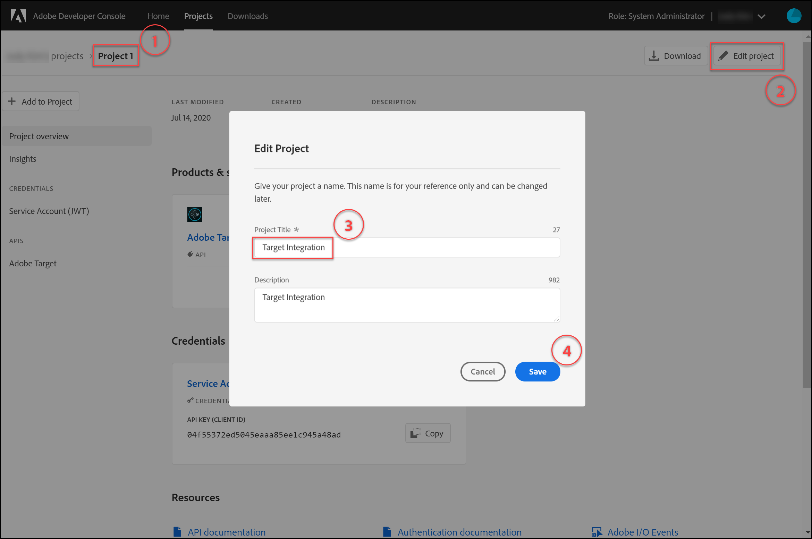
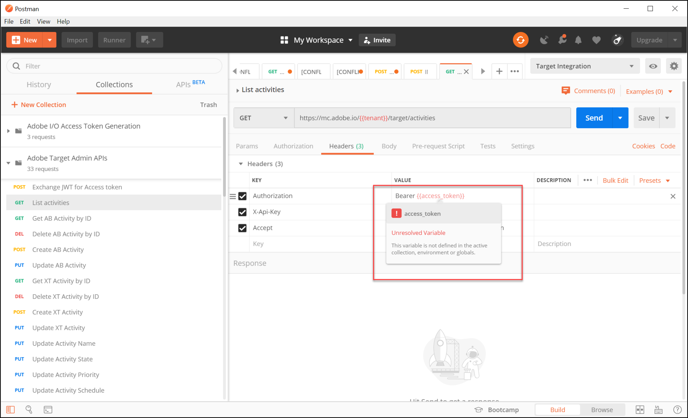
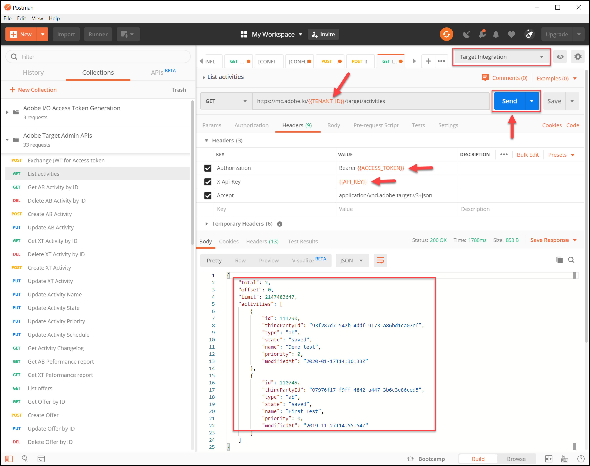

# 設定驗證 [!DNL Adobe Target] API

此 [!DNL Adobe Target] 管理API，包括 [!DNL Recommendations Admin] API由驗證保護，以確保僅授權使用者使用它們來存取 [!DNL Adobe Target]. 使用 [Adobe Developer Console](https://developer.adobe.com/console/home) 以管理所有使用者的驗證 [!DNL Adobe Experience Cloud solutions]，包括 [!DNL Adobe Target].

>[!IMPORTANT]
>
>本文所述的服務帳戶(JWT)憑證將遭取代，以支援新的OAuth伺服器對伺服器憑證。
>
>服務帳戶(JWT)憑證將繼續使用至2025年1月1日。 您必須移轉應用程式或整合，才能在2025年1月1日之前使用新的OAuth伺服器對伺服器認證。
>
>如需移轉整合的詳細資訊和逐步指示，請參閱 [從服務帳戶(JWT)認證移轉至OAuth伺服器對伺服器認證](https://developer.adobe.com/developer-console/docs/guides/authentication/ServerToServerAuthentication/migration/){target=_blank} 在 *開發人員主控台* 檔案。
>
>如需設定新OAuth憑證的資訊，請參閱 [OAuth伺服器對伺服器認證實作](https://developer.adobe.com/developer-console/docs/guides/authentication/ServerToServerAuthentication/implementation/){target=_blank} 在 *開發人員主控台* 檔案。

以下為產生舊版JWT驗證權杖所需的初步步驟，以便與成功互動 [!DNL Adobe Target] API：

1. 在中建立專案（先前稱為整合） [!DNL Adobe Developer Console].
1. 將專案詳細資料匯出至Postman。
1. 產生持有者存取權杖。
1. 測試持有者存取權杖。

## 先決條件

| 資源 | 詳細資料 |
| --- | --- |
| Postman | 為了成功完成這些步驟，請取得 [Postman應用程式](https://www.postman.com/downloads/) 適用於您的作業系統。 Postman basic可免費建立帳戶。 雖然並非必要專案才能使用 [!DNL Adobe Target] API一般而言，Postman可讓API工作流程更容易，並且 [!DNL Adobe Target] 提供多個Postman集合，以協助執行其API並瞭解其運作方式。 本指南的其餘部分假設您具備Postman的工作知識。 如需協助，請參閱 [Postman檔案](https://learning.getpostman.com/). |
| 參考 | 在本指南的其餘部分中假設您熟悉以下資源：<ul><li>[Adobe I/OGithub](https://github.com/adobeio)</li><li>[Target管理員和設定檔API檔案](../administer/admin-api/admin-api-overview-new.md)</li><li>[Recommendations API檔案](https://developers.adobetarget.com/api/recommendations/)</li></ul> |

## 建立Adobe I/O專案

在本節中，您將存取 [!DNL Adobe Developer Console] 並為建立專案 [!DNL Adobe Target]. 如需詳細資訊，請參閱 [專案檔案](https://developer.adobe.com/developer-console/docs/guides/projects/).

&lt;!---(1. 根據「 」產生您的私密金鑰和公開憑證 [有關驗證的檔案](https://developer.adobe.com/developer-console/docs/guides/authentication/).// [//]： # (如所述 **步驟1** 之 [如何設定AdobeIO：驗證 — 逐步進行](https://helpx.adobe.com/marketing-cloud-core/kb/adobe-io-authentication-step-by-step.html). 完成步驟1後，請返回本指南並繼續執行以下步驟2。//此步驟的結果應是建立 `private.key` 檔案和 `certificate_pub.crt` 檔案。 產生這兩個檔案之後，請回到本指南。)—>

1. 在 [Adobe Admin Console](https://adminconsole.adobe.com/)，確定您的 [!DNL Adobe] 使用者帳戶已同時被授予 [產品管理員](https://helpx.adobe.com/enterprise/using/admin-roles.html) 和 [開發人員](https://helpx.adobe.com/enterprise/using/manage-developers.html) 層級存取至 [!DNL Target].

1. 在 [Adobe Developer Console](https://developer.adobe.com/console/home)，選取 [!UICONTROL Experience Cloud組織] 要為其建立此整合的專案。 (請注意，您可能只能存取單一 [!UICONTROL Experience Cloud組織].)

   

1. 按一下 **[!UICONTROL 建立新專案]**.

   

1. 按一下 **[!UICONTROL 新增API]** 新增REST API至您的專案以存取 [!DNL Adobe] 服務與產品。

   

1. 選取 **[!DNL Adobe Target]** 作為 [!DNL Adobe] 要整合的服務。 按一下 **[!UICONTROL 下一個]** 按鈕隨即顯示。

   

1. 選取一個選項，將公開和私密金鑰與您要建立的服務帳戶整合建立關聯 [!DNL Target]. 在此範例中，選取 **[!UICONTROL 選項1：產生金鑰組]** 並按一下 **[!UICONTROL 產生金鑰組]**.

   

1. 依照指示，記下自動下載的組態檔(`config`)，其中包含您的私密金鑰。 按&#x200B;**[!UICONTROL 「下一步」]**。

   

1. 在您的檔案系統中，確認 `config`，在上一步建立的壓縮組態檔。 同樣地，這個 `config` 檔案包含您的私密金鑰，您稍後需要這些金鑰。 檔案系統內的確切位置可能與此處顯示的位置不同。

   

1. 返回Adobe Developer Console，選取 [產品設定檔](https://helpx.adobe.com/enterprise/using/manage-products-and-profiles.html) 與您在其中使用Adobe Recommendations的屬性相對應。 （如果您未使用屬性，請選取「預設工作區」選項。） 按一下 **[!UICONTROL 儲存已設定的API]**.

   

1. 按一下 **[!UICONTROL 建立整合]**. 您應該會收到暫時訊息，指出您的API已成功設定。
1. 最後一個步驟，是將專案重新命名為比原始專案更有意義的名稱 `Project 1`. 若要這麼做，請使用導覽路徑顯示來導覽至專案，按一下 **[!UICONTROL 編輯專案]** 以存取 **[!UICONTROL 編輯專案]** 模型，並重新命名專案。

   

>[!NOTE]
>
>在此範例中，我們將專案命名為&quot;[!DNL Target] 整合。」 如果您預期使用專案的不只是 [!DNL Adobe Target]，則您可能想要據以命名。 例如，您可能會選擇將其命名為「AdobeAPI」或「Experience CloudAPI」，因為它可與Adobe Experience Cloud中的其他解決方案搭配使用。

## 匯出專案詳細資料

現在您已擁有Adobe專案，可用來存取 [!DNL Target]，您必須確定傳送該專案的詳細資訊以及AdobeAPI要求。 若要與多個AdobeAPI互動，包括多個 [!DNL Target] API。 例如，整合詳細資料包括所需的授權和驗證資訊 [!DNL Target] 管理API。 因此，若要搭配Postman使用API，您必須將這些詳細資料帶入Postman。

有許多方式可在Postman中指定您專案的詳細資料，但在本節中，我們利用了某些預先建立的功能和集合。 首先（在本節中），您會將整合的詳細資訊匯出至Postman環境。 接下來（在以下區段中），您將產生持有者存取權杖，以授予您存取必要Adobe資源的許可權。

>[!NOTE]
>
>適用於任何Experience Cloud解決方案的視訊指示，包括 [!DNL Target]，請參閱 [搭配使用Postman與Experience Platform API](https://experienceleague.adobe.com/docs/platform-learn/tutorials/platform-api-authentication.html). 以下小節與 [!DNL Target] API： 1. 建立Experience Platform API並將其匯出至Postman 2。 使用Postman產生存取權杖。 以下也提供這些步驟。

1. 仍在 [Adobe Developer Console](https://developer.adobe.com/console/home)，導覽以檢視您的新專案 **[!UICONTROL 服務帳戶(JWT)]** 認證。 使用左側導覽或 **[!UICONTROL 認證]** 區段，如下所示。

   

   在 **[!UICONTROL 認證詳細資料]**，請注意，您可以檢視 **[!UICONTROL 公開金鑰]**， **[!UICONTROL 使用者端ID]**，以及與您的服務帳戶相關的其他資訊。

   

1. 按一下以導覽至 **[!DNL Adobe Target]** API。 使用左側導覽或 **連線的產品和服務** 區段，如下所示。

   

1. 按一下 **[!UICONTROL Postman專用下載]** > **[!UICONTROL 服務帳戶(JWT)]** 建立擷取Postman環境驗證資訊的JSON檔案。

   

   請記下檔案系統中的JSON檔案。

   

1. 在Postman中，按一下齒輪圖示來管理您的環境，然後按一下 **[!UICONTROL 匯入]** 匯入JSON檔案（環境）。

   

1. 選擇您的檔案，然後按一下 **[!UICONTROL 開啟]**.

   

1. 在Postman中 **管理環境** 強制回應視窗，按一下新匯入環境的名稱以進行檢查。 (您的環境名稱可能與此處顯示的名稱不同。 視需要編輯名稱。 它不一定需要符合 [!DNL Adobe] 專案。)

   

1. 注意 `CLIENT_SECRET` 和 `API_KEY` （連同其他變數）會預先填入其值，取自您在Adobe Developer主控台中定義的整合。 (Postman `CLIENT_SECRET` 變數應符合 `CLIENT SECRET` 開發人員控制檯中顯示的Adobe認證，以及 `API_KEY` 在Postman中也應相符 `CLIENT ID` （位於開發人員主控台）。 相反地，注意 `PRIVATE_KEY`， `JWT_TOKEN`、和 `ACCESS_TOKEN` 為空白。 讓我們從提供 `PRIVATE_KEY` 值。

   

1. 從您的檔案系統，開啟 `config` 檔案，並開啟 `private` 金鑰檔案。

   

1. 選擇並複製所有內容 `private` 金鑰檔案。

   

1. 在Postman中，將您的私密金鑰值貼到 **[!UICONTROL 初始值]** 和 **[!UICONTROL 目前值]** 欄位。

   

1. 按一下 **[!UICONTROL 更新]**，然後關閉環境強制回應視窗。

## 產生持有者存取權杖

在本節中，您會產生持有者存取權杖，這是驗證您與的互動所需的權杖 [!DNL Adobe Target] API。 若要產生持有者存取Token，您必須將整合詳細資訊（建立於上節中）傳送至 [AdobeIdentity Management服務(IMS)](https://www.adobe.io/authentication/auth-methods.html#!AdobeDocs/adobeio-auth/master/AuthenticationOverview/AuthenticationGuide.md). 有幾種方法可以達成此目的，但在本指南中，我們利用了包含預先建立IMS呼叫的Postman集合，讓程式簡單明瞭。 匯入集合後，您可以視需要重複使用它，以產生新的代號，而不只是用於 [!DNL Adobe Target]、以及其他Adobe API。

1. 導覽至 [AdobeIdentity Management服務API範例呼叫](https://github.com/adobe/experience-platform-postman-samples/tree/master/apis/ims).

   

1. 按一下 **[!UICONTROL 產生Postman集合的Adobe I/O存取權杖]**.

   

1. 按一下「 」以取得此集合的原始JSON **[!UICONTROL 原始]**，然後將產生的JSON複製到剪貼簿。 （您也可以將原始JSON儲存為.json檔案。）

   

1. 在Postman中，透過貼上並從剪貼簿提交原始JSON來匯入集合。 （您也可以上傳已儲存的.json檔案）。 按一下&#x200B;**[!UICONTROL 「繼續」]**。

   

1. 選取 **[!UICONTROL IMS：JWT透過使用者權杖產生+驗證]** 請求產生PostmanAdobe I/O存取權杖集合，確認已選取您的環境，然後按一下 **[!UICONTROL 傳送]** 以產生權杖。

   

   >[!NOTE]
   >
   >此持有者存取權杖的有效期限為24小時。 每當您需要產生新Token時，請再次傳送請求。

1. 再次開啟管理環境強制回應視窗，然後選取您的環境。

   

1. 請注意 `ACCESS_TOKEN` 和 `JWT_TOKEN` 現在會填入值。

   

問題：我是否必須使用Adobe I/O存取權杖產生Postman集合來產生JSON Web權杖(JWT)和持有者存取權杖？

答案：否。 Adobe I/O存取權杖產生Postman集合可方便在Postman中更輕鬆地產生JWT和持有者存取權杖。 或者，您可以使用Adobe Developer主控台中的功能，手動產生持有者存取權杖。

## 測試持有者存取權杖

在本練習中，您將傳送一個API請求來使用新的持有者存取權杖，該請求會從您的中擷取活動清單 [!DNL Target] 帳戶。 成功的回應表示您的 [!DNL Adobe] 專案和驗證如預期運作，以使用API。

1. 匯入 [[!DNL Adobe Target] 管理API Postman集合](https://developers.adobetarget.com/api/#admin-postman-collection). 按照所有提示操作，直到在Postman中匯入集合為止。

   

1. 展開集合，然後記下 **[!UICONTROL 列出活動]** 要求。

   

1. 請注意，變數如 `{{access_token}}` 一開始未解決。 您可以用數種不同的方式解決此問題 — 例如，您可以定義新的集合變數，稱為 `{{access_token}}` — 但在本指南中，您將會變更API請求，以運用您先前使用的Postman環境。 如此一來，環境就能繼續以單一、一致的方式整合AdobeAPI間所有通用變數。

   

1. 要取代的型別 `{{access_token}}` 替換為 `{{ACCESS_TOKEN}}`.

   

1. 要取代的型別 `{{api_key}}` 替換為 `{{API_KEY}}`.

   

1. 要取代的型別 `{{tenant}}` 替換為 `{{TENANT_ID}}`. 注意 `{{TENANT_ID}}` 尚未辨識。

   

1. 開啟管理環境強制回應視窗，然後選取您的環境。

   

1. 輸入以新增 `{{TENANT_ID}}` 環境變數。 複製租使用者ID值並貼到中 **[!UICONTROL 初始值]** 和 **[!UICONTROL 目前值]** 新欄位 `TENANT_ID` 環境變數。

   

   >[!NOTE]
   >
   >租使用者ID與您的不同 [!DNL Target] `clientcode`. 當您登入時，租使用者ID存在於URL中 [!DNL Target]. 若要取得租使用者ID，請登入Adobe Experience Cloud，然後開啟 [!DNL Target]，然後按一下Target卡片。 使用URL子網域中所述的租使用者ID值。 例如，如果您在登入時的URL [!DNL Adobe Target] 是 `<https://mycompany.experiencecloud.adobe.com/...>` 則您的租使用者ID為「mycompany」。

1. 在確認您已選取正確的環境後，傳送您的請求。 您應會收到包含活動清單的回應。

   

現在您已驗證Adobe驗證，接下來可以使用它來與互動 [!DNL Adobe Target] API (以及其他AdobeAPI)。 例如，您可以 [使用Recommendations API](recs-api/overview.md) 以建立或管理建議，或者您可以將其用於 [Target傳送API](/help/dev/implement/delivery-api/overview.md).
