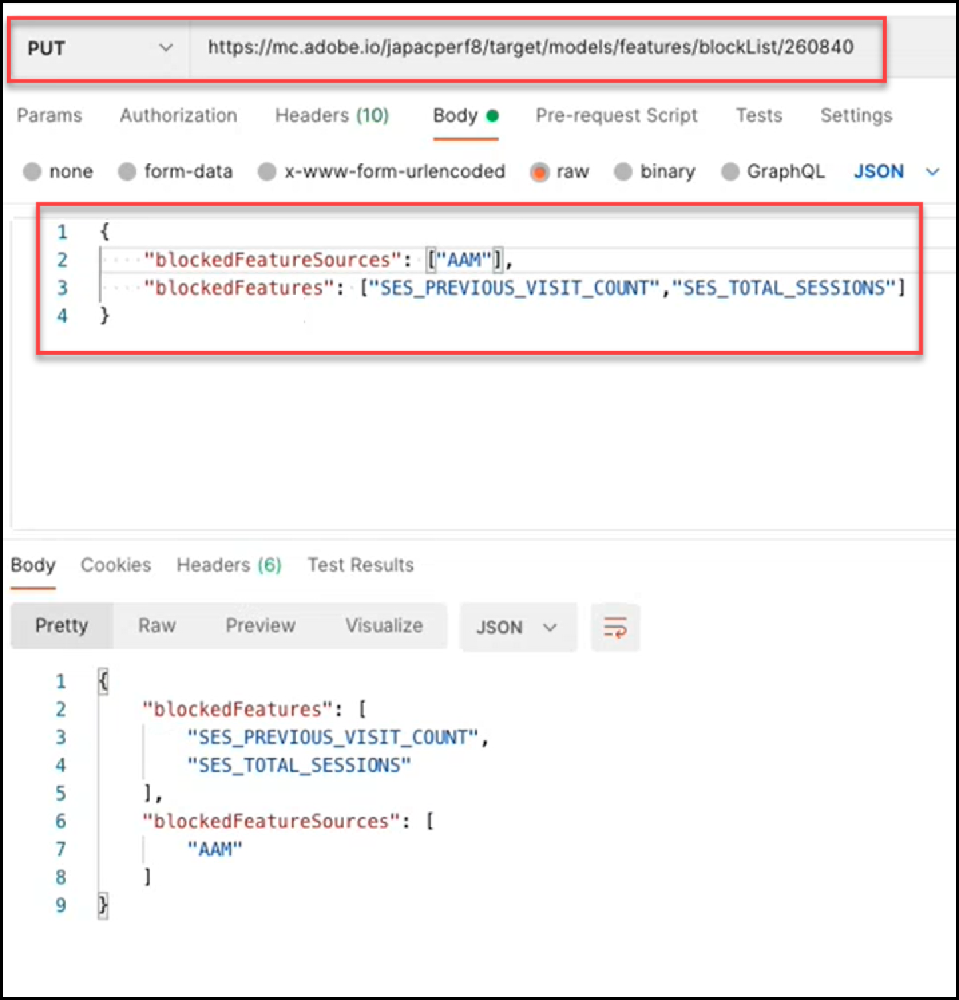
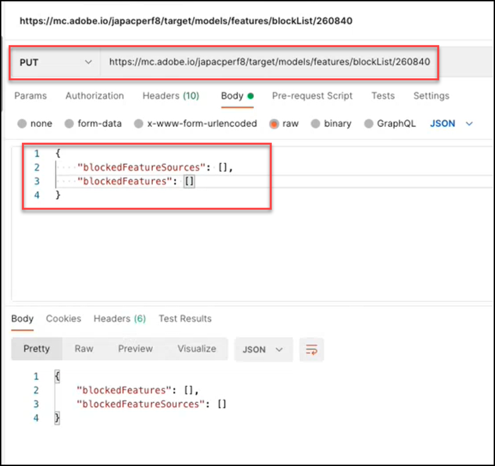

# 模型API概觀

模型API （也稱為Blocklist API）可讓使用者檢視和管理機器學習模型中用於下列用途的功能清單 [!UICONTROL Automated Personalization] (AP)和 [!DNL Auto-Target] (AT)活動。 如果使用者想排除模型用於AP或AT活動的功能，他們可以使用模型API將該功能新增到「封鎖清單」。

A **[!UICONTROL 封鎖清單]** 定義將排除的功能集 [!DNL Adobe Target] 機器學習模型。 如需功能的詳細資訊，請參閱 [使用的資料 [!DNL Target] 機器學習演演算法](https://experienceleague.adobe.com/docs/target/using/activities/automated-personalization/ap-data.html).

封鎖清單可依活動（活動層級）定義，或針對內的所有活動定義 [!DNL Target] 帳戶（全域層級）。

<!-- To get started with the Models API in order to create and manage your blocklist, download the Postman Collection [here](https://git.corp.adobe.com/target/ml-configuration-management-service/tree/nextRelease/rest_api_library). Note this is an Adobe internal link. Need to publish this publicly if want to share with customers. -->

## 模型API規格

檢視模型API規格 [此處](../administer/models-api/models-api-overview.md).

## 必要條件

若要使用模型API，您必須使用 [Adobe Developer Console](https://developer.adobe.com/console/home)，就像您使用 [Target管理員API](../administer/admin-api/admin-api-overview-new.md). 如需詳細資訊，請參閱 [如何設定驗證](../before-administer/configure-authentication.md).

## 模型API使用准則

如何管理封鎖清單

[**步驟1：**](#step1) 檢視活動的功能清單

[**步驟2：**](#step2) 檢查活動的封鎖清單

[**步驟3：**](#step3) 將功能新增至活動的封鎖清單

[**步驟4：**](#step4) （可選）解除封鎖

[**步驟5：**](#step5) （選用）管理全域封鎖清單


## 步驟1：檢視活動的功能清單 {#step1}

在封鎖功能之前，請先檢視目前包含在該活動模型中的功能清單。

>[!BEGINTABS]

>[!TAB 請求]

```json {line-numbers="true"}
GET https://mc.adobe.io/<tenant>/target/models/features/<campaignId>
```

>[!TAB 回應]

```json {line-numbers="true"}
{
    "features": [
        {
            "externalName": "Visitor Profile - Total Visits to Activity",
            "internalName": "SES_PREVIOUS_VISIT_COUNT",
            "type": "CONTINUOUS"
        },
        {
            "externalName": "Visitor Profile - Total Visits",
            "internalName": "SES_TOTAL_SESSIONS",
            "type": "CONTINUOUS"
        },
        {
            "externalName": "Visitor Profile - Pages Seen Before Activity",
            "internalName": "SES_PREVIOUS_VISIT_COUNT",
            "type": "CONTINUOUS"
        },
        {
            "externalName": "Visitor Profile - Activity Lifetime Time on Site",
            "internalName": "SES_TOTAL_TIME",
            "type": "CONTINUOUS"
        }
    ],
    "reportParameters": {
        "clientCode": <tenant>,
        "campaignId": <campaignId>
    }
}
```

>[!ENDTABS]

<!-- JUDY: Update codeblock above once you have the complete Response. -->

在此處的範例中，使用者正在檢查其活動ID為260840的活動之模型中使用的功能清單。


>[!NOTE]
>
>若要尋找活動的活動ID，請導覽至 [!DNL Target] UI。 按一下感興趣的活動。 活動ID會顯示在產生的「活動概覽」頁面內文中，以及該頁面的URL結尾處。

此 **[!UICONTROL externalname]** 是功能的好記名稱。 建立者： [!DNL Target]，此值可能會隨著時間變更。 使用者可以在以下位置檢視這些好記的名稱： [個人化前瞻分析報表](https://experienceleague.adobe.com/docs/target/using/reports/insights/personalization-insights-reports.html).

此 **[!UICONTROL internalName]** 是功能的實際識別碼。 建立者也是 [!DNL Target]，但無法變更。 這是您需要參考的值，以識別要加入封鎖清單的功能。

請注意，為了讓功能清單填入值（亦即為了使其成為非空值），活動：

1. 必須具有「狀態= Live」，或之前必須已啟用
1. 執行時間必須夠長，才能有促銷活動活動，因此模型必須對其執行資料。

## 步驟2：檢查活動的封鎖清單 {#step2}

接下來，檢視封鎖清單。 換言之，檢查哪些功能（如果有的話）目前被封鎖而無法納入此活動的模型中。

>[!ERROR]
>
>請注意 `/blockList/` 在請求中區分大小寫。

>[!BEGINTABS]

>[!TAB 請求]

```json {line-numbers="true"}
GET https://mc.adobe.io/<tenant>/target/models/features/blockList/<campaignId>
```

>[!TAB 回應]

```json {line-numbers="true"}

```

>[!ENDTABS]

在此處的範例中，使用者正在檢查其活動ID為260840的活動之封鎖功能清單。 結果為空白，這表示此活動目前沒有任何已加入封鎖清單的功能。


>[!NOTE]
>
>在新增任何功能之前，第一次檢視完整封鎖清單時，您可能會看到類似這樣的空白結果。 但是，一旦從封鎖清單中新增（以及隨後移除）功能後，您可能會看到稍微不同的結果，其中傳回空白的已加入封鎖清單的功能陣列。 請繼續閱讀，以在中檢視範例 [步驟4](#step4).

## 步驟3：將功能新增至活動的封鎖清單 {#step3}

若要新增功能至封鎖清單，請將請求從GET變更為PUT，並修改請求內文以指定 `blockedFeatureSources` 或 `blockedFeatures` 視需要。

* 要求內文需要 `blockedFeatures` 或 `blockedFeatureSources`. 兩者皆可納入。
* 填入 `blockedFeatures` 具有的值識別自 `internalName`. 另請參閱 [步驟1](#step1).
* 填入 `blockedFeatureSources` ，其值來自下表。

請注意 `blockedFeatureSources` 表示特徵的來源。 為了加入封鎖清單，它們可作為功能群組或類別，讓使用者一次封鎖整組功能。 下列專案的值 `blockedFeatureSources` 符合功能識別碼的前幾個字元(`blockedFeatures` 或 `internalName` 值)，因此它們也可能視為「功能首碼」。

### 表格： `blockedFeatureSources` 值 {#table}

| 前置詞 | 說明 |
| --- | --- |
| 方塊 | Mbox 參數 |
| URL | 自訂 — URL引數 |
| 環境 | 環境 |
| SES | 訪客設定檔 |
| 地理 | 地理位置 |
| PRO | 自訂 — 設定檔 |
| SEG | 自訂 — 報表區段 |
| AAM | 自訂 — Experience Cloud區段 |
| MOB | 行動 |
| CRS | 自訂 — 客戶屬性 |
| UPA | 自訂 — RT-CDP設定檔屬性 |
| IAC | 訪客興趣區域 |  |

>[!BEGINTABS]

>[!TAB 請求]

```json {line-numbers="true"}
PUT https://mc.adobe.io/<tenant>/target/models/features/blockList/<campaignId>

{
    "blockedFeatureSources": ["AAM"],
    "blockedFeatures": ["SES_PREVIOUS_VISIT_COUNT", "SES_TOTAL_SESSIONS"]
}
```

>[!TAB 回應]

```json {line-numbers="true"}
{
    "blockedFeatures": [
            "SES_PREVIOUS_VISIT_COUNT",
            "SES_TOTAL_SESSIONS"
        ],
    "blockedFeatureSources": [
            "AAM"
        ]
}
```

>[!ENDTABS]

在此範例中，使用者封鎖兩項功能， `SES_PREVIOUS_VISIT_COUNT` 和 `SES_TOTAL_SESSIONS`，其先前識別方法是查詢活動ID為260480的活動之完整功能清單，如所述 [步驟1](#step1). 他們也會封鎖來自Experience Cloud區段的所有功能，方法是封鎖前置詞為「AAM」的功能，如 [表格](#table) 以上。



請注意，將功能加入封鎖清單後，建議您執行以驗證更新的封鎖清單 [步驟2](#step2) (GET封鎖清單)。 確認結果如預期般顯示(確認結果包含最新PUT請求新增的功能)。

## 步驟4：（選擇性）解除封鎖 {#step4}

若要解除封鎖所有已加入封鎖清單的功能，請清除以下專案的值： `blockedFeatureSources` 或 `blockedFeatures`.

>[!BEGINTABS]

>[!TAB 請求]

```json {line-numbers="true"}
PUT https://mc.adobe.io/<tenant>/target/models/features/blockList/<campaignId>

{
    "blockedFeatureSources": [],
    "blockedFeatures": []
}
```

>[!TAB 回應]

```json {line-numbers="true"}
{
    "blockedFeatures": [],
    "blockedFeatureSources": []
}
```

>[!ENDTABS]

在此處的範例中，使用者正在清除260840有活動ID之活動的封鎖清單。 請注意，回應會確認已封鎖功能及其來源的空白陣列 — `blockedFeatureSources` 和 `blockedFeatures`，依序輸入。



修改封鎖清單後，建議您照常執行 [步驟2](#step2) 再次(GET封鎖清單以確認清單如預期包含功能)。 在此處的範例中，使用者正在驗證其封鎖清單現在是否為空。


問題：如何刪除封鎖清單中的部分（但非全部）？

回答：若要從多功能封鎖清單中移除已封鎖功能的離散子集，使用者只需傳送要封鎖的更新功能清單即可 [封鎖清單請求](#step3)，而不是清除整個封鎖清單並重新新增所需的功能。 換言之，請傳送更新的功能清單（如所示） [步驟3](#step3))，確定從封鎖清單中排除您要「刪除」的功能。

## 步驟5： （選用）管理全域封鎖清單 {#step5}

上述範例均在單一活動的內容中。 您也可以封鎖指定使用者端（租使用者）上所有活動的功能，而不必個別指定每個活動的封鎖清單。 若要執行全域封鎖清單，請使用 `/blockList/global` 呼叫，而不是 `blockList/<campaignId>`.

>[!BEGINTABS]

>[!TAB 請求]

```json {line-numbers="true"}
PUT https://mc.adobe.io/<tenant>/target/models/features/blockList/global

{
    "blockedFeatureSources": ["AAM", "PRO", "ENV"],
    "blockedFeatures": ["AAM_FEATURE_1", "AAM_FEATURE_2"]
}
```

>[!TAB 回應]

```json {line-numbers="true"}
{
    "blockedFeatures": [
        "AAM_FEATURE_1",
        "AAM_FEATURE_2"
    ],
    "blockedFeatureSources": [
        "AAM",
        "PRO",
        "ENV"
    ]
}
```

>[!ENDTABS]

在上面顯示的範例請求中，使用者針對其所有活動封鎖兩項功能： 「AAM_FEATURE_1」及「AAM_FEATURE_2」 [!DNL Target] 帳戶。 這表示無論活動為何，「AAM_FEATURE_1」和「AAM_FEATURE_2」都不會包含在此帳戶的機器學習模型中。 此外，使用者也會全域封鎖首碼為&quot;AAM&quot;、&quot;PRO&quot;或&quot;ENV&quot;的所有功能。

問題：上述程式碼範例不是多餘的嗎？

回答：是。 若封鎖的值以「AAM」開頭的功能，同時封鎖來源為「AAM」的所有功能，則是多餘的。 最終結果是所有來源於AAM (Experience Cloud區段)的功能將會遭到封鎖。 因此，如果目標是要封鎖「Experience Cloud區段」中的所有功能，則不需要在上述範例中以「AAM」開頭個別指定某些功能。

最後一個步驟：無論是在活動或全域層級，都建議您在修改封鎖清單後加以驗證，以確保其包含您預期的值。 若要這麼做，請變更 `PUT` 至 `GET`.

以下顯示的範例回應指出 [!DNL Target] 會封鎖兩項個別功能，以及源自「AAM」、「PRO」和「ENV」的所有功能。


