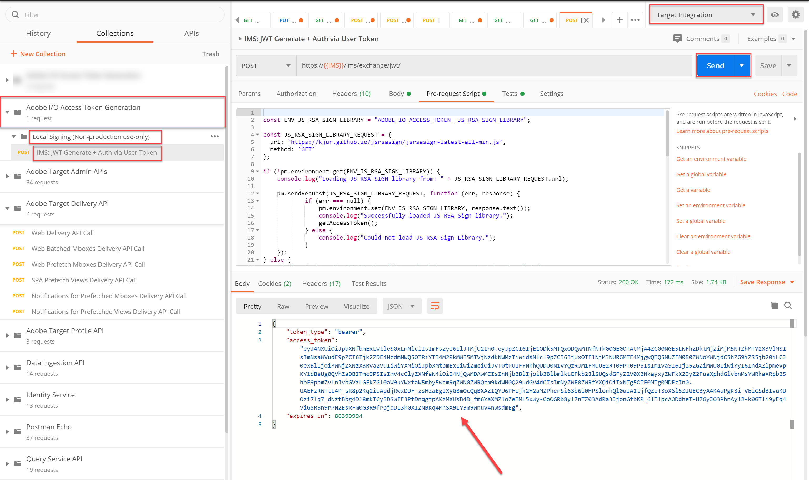
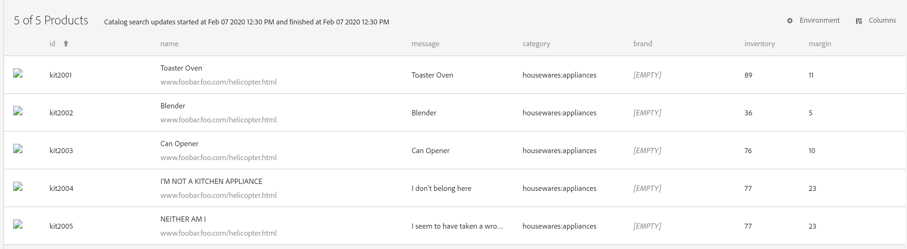
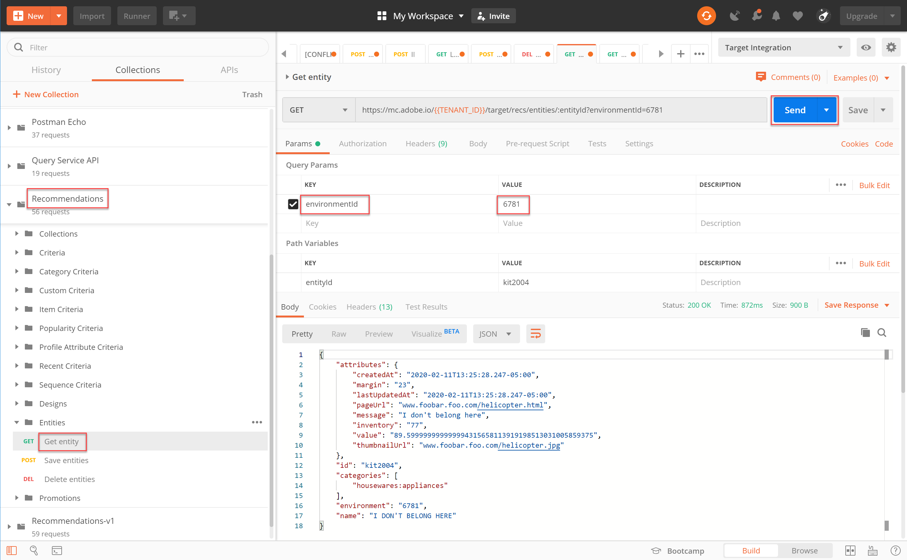

# 使用API管理您的Recommendations目錄

在確保您符合[使用Recommendations API](/help/dev/before-administer/recs-api/overview.md#prerequisites)的要求時，您已瞭解如何[使用JWT驗證流程來產生存取權杖](/help/dev/before-administer/configure-authentication.md)，以便在[Adobe Developer Console](https://developer.adobe.com/console/home)上使用[!DNL Adobe Target]管理API。

您現在可以使用[Recommendations API](https://developer.adobe.com/target/administer/recommendations-api/)來新增、更新或刪除建議目錄中的專案。 與其他Adobe Target Admin API一樣，Recommendations API需要驗證。

>[!NOTE]
>
>每當您需要重新整理存取權杖以進行驗證時，請傳送&#x200B;**[!UICONTROL IMS: JWT Generate + Auth via User Token]**&#x200B;請求，因為它會在24小時後過期。 如需指示，請參閱[設定AdobeAPI驗證](../configure-authentication.md)。



繼續之前，請先取得[Recommendations Postman集合](https://developer.adobe.com/target/administer/recommendations-api/#section/Postman)。

## 使用儲存實體API建立和更新專案

若要使用API （而非CSV產品摘要或產品頁面上引發的Target請求）填入您的Recommendations產品資料庫，請使用[儲存實體API](https://developer.adobe.com/target/administer/recommendations-api/#operation/saveEntities)。 此請求會在單一Target環境中新增或更新專案。 語法為：

```
POST https://mc.adobe.io/{{TENANT_ID}}/target/recs/entities
```

例如，「儲存實體」可用於在達到某些臨界值時（例如存貨或價格的臨界值）更新專案，以標示這些專案並防止它們被建議。

1. 導覽至「**[!UICONTROL Target]** > **[!UICONTROL Setup]** > **[!UICONTROL Hosts]** > **[!UICONTROL CONTROL Environments]**」以取得您要在其中新增或更新專案的目標環境ID。

   

1. 驗證`TENANT_ID`和`API_KEY`參考先前建立的Postman環境變數。 使用下圖來比較。 如有必要，請修改API請求中的標題和路徑，使其與以下影像中的標題和路徑相符。

   

1. 在&#x200B;**內文**&#x200B;中輸入您的JSON作為&#x200B;**原始**&#x200B;程式碼。 別忘了使用`environment`變數指定您的環境ID。 （在以下範例中，環境ID為6781。）

   

   以下是將entity.id kit2001與Toaster Oven產品的關聯實體值新增到環境6781中的範例JSON。

   ```
       {
       "entities": [{
               "name": "Toaster Oven",
               "id": "kit2001",
               "environment": 6781,
               "categories": [
                   "housewares:appliances"
               ],
               "attributes": {
                   "inventory": 77,
                   "margin": 23,
                   "message": "crashing helicopter",
                   "pageUrl": "www.foobar.foo.com/helicopter.html",
                   "thumbnailUrl": "www.foobar.foo.com/helicopter.jpg",
                  "value": 19.2
               }
           }]
       }
   ```

1. 按一下&#x200B;**[!UICONTROL Send]**。 您應會收到下列回應。

   

   JSON物件可以調整規模，以傳送多個產品。 例如，此JSON會指定兩個實體。

   ```
       {
           "entities": [{
                   "name": "Toaster Oven",
                   "id": "kit2001",
                   "environment": 6781,
                   "categories": [
                       "housewares:appliances"
                   ],
                   "attributes": {
                       "inventory": 89,
                       "margin": 11,
                       "message": "Toaster Oven",
                       "pageUrl": "www.foobar.foo.com/helicopter.html",
                       "thumbnailUrl": "www.foobar.foo.com/helicopter.jpg",
                       "value": 102.5
                   }
               },
               {
                   "name": "Blender",
                   "id": "kit2002",
                   "environment": 6781,
                   "categories": [
                       "housewares:appliances"
                   ],
                   "attributes": {
                       "inventory": 36,
                       "margin": 5,
                       "message": "Blender",
                       "pageUrl": "www.foobar.foo.com/helicopter.html",
                       "thumbnailUrl": "www.foobar.foo.com/helicopter.jpg",
                       "value": 54.5
                   }
               }
           ]
       }
   ```

1. 現在輪到你了！ 使用&#x200B;**[!UICONTROL Save Entities]** API將下列專案新增至您的目錄。 使用上述範例JSON作為起點。 （您需要擴充JSON以包含其他實體。）

   

看來最後兩個專案並不屬於。 讓我們使用&#x200B;**[!UICONTROL Get Entity]** API檢查這些專案，必要時請使用&#x200B;**[!UICONTROL Delete Entities]** API刪除它們。

## 使用取得實體API取得專案詳細資料

若要擷取現有專案的詳細資料，請使用[取得實體API](https://developer.adobe.com/target/administer/recommendations-api/#operation/getEntity)。 語法為：

```
GET https://mc.adobe.io/{{TENANT_ID}}/target/recs/entities/[entity.id]
```

一次只能為單一實體擷取實體詳細資料。 您可以使用「取得實體」來確認如預期般在目錄中進行的更新，或稽核目錄的內容。

1. 在API要求中，使用變數`entityId`指定實體識別碼。 下列範例將傳回entityId=kit2004之實體的詳細資料。

   

1. 驗證`TENANT_ID`和`API_KEY`參考先前建立的Postman環境變數。 使用下圖來比較。 如有必要，請修改API請求中的標題和路徑，使其與以下影像中的標題和路徑相符。

   

1. 傳送要求。

   
如果您收到錯誤訊息，指出找不到實體（如上述範例所示），請確認您要將請求提交至正確的Target環境。


   >[!NOTE]
   >
   >如果未明確指定任何環境，則取得實體只會嘗試從您的[預設環境](https://experienceleague.adobe.com/docs/target/using/administer/environments.html?lang=zh-Hant)取得實體。 如果您想從預設環境以外的任何環境提取，則必須指定環境ID。

1. 如有必要，請新增`environmentId`引數，然後重新傳送要求。

   

1. 傳送另一個&#x200B;**[!UICONTROL Get Entity]**&#x200B;要求，這次檢查其entityId=kit2005的實體。

   

假設您決定需要從目錄中移除這些實體。 讓我們使用&#x200B;**[!UICONTROL Delete Entities]** API。

## 使用Delete Entities API刪除專案

若要從目錄中移除專案，請使用[刪除實體API](https://developer.adobe.com/target/administer/recommendations-api/#operation/deleteEntities)。 語法為：

```
DELETE https://mc.adobe.io/{{TENANT_ID}}/target/recs/entities?ids=[comma-delimited-entity-ids]&environment=[environmentId]
```

>[!WARNING]
>
>刪除實體API會刪除您指定的ID所參考的實體。 如果未提供實體ID，則會刪除指定環境中的所有實體。 如果未指定環境ID，實體將從所有環境中刪除。 請謹慎使用！

1. 導覽至「**[!UICONTROL Target]** > **[!UICONTROL Setup]** > **[!UICONTROL Hosts]** > **[!UICONTROL Environments]**」以取得您要刪除專案的目標環境ID。

   

1. 在API要求中，使用語法`&ids=[comma-delimited-entity-ids]` （查詢引數）指定您要刪除之實體的實體ID。 刪除多個實體時，請使用逗號區隔ID。

   

1. 使用語法`&environment=[environmentId]`指定環境ID，否則將會刪除所有環境中的實體。

   

1. 驗證`TENANT_ID`和`API_KEY`參考先前建立的Postman環境變數。 使用下圖來比較。 如有必要，請修改API請求中的標題和路徑，使其與以下影像中的標題和路徑相符。

   

1. 傳送要求。

   

1. 使用&#x200B;**[!UICONTROL Get Entity]**&#x200B;驗證您的結果，現在應表示找不到已刪除的實體。

   

   

恭喜！您現在可以使用Recommendations API來建立、更新、刪除及取得目錄中實體的詳細資訊。 在下一節中，您將瞭解如何管理自訂條件。

&lt;！— [下堂課「管理自訂條件」>](manage-custom-criteria.md) —>
