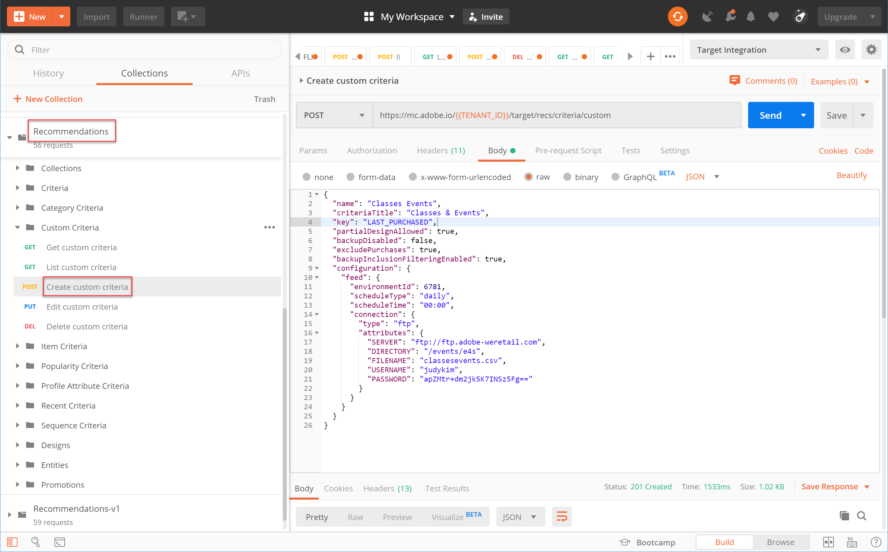
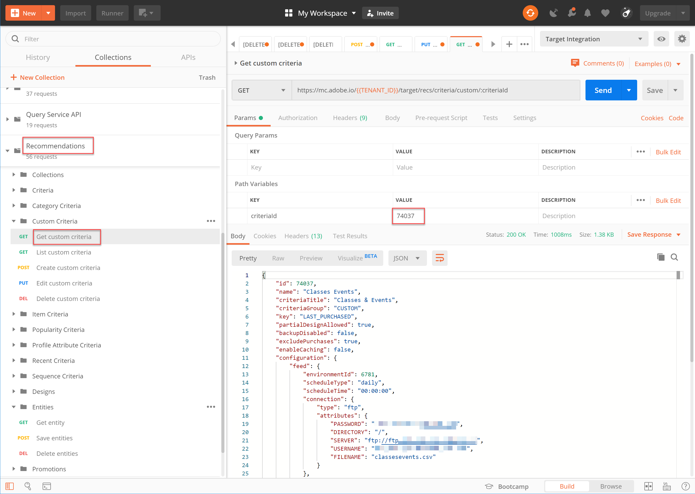

# 管理自訂條件

有時Recommendations提供的演演算法無法呈現您想要促銷的特定專案。 在這種情況下，自訂條件提供了一種方法，可讓您為指定的關鍵專案或類別傳送一組特定的建議專案。

若要建立自訂條件，請定義並匯入關鍵專案或類別與建議專案之間的所需對應。 此程式的說明請參閱 [自訂條件檔案](https://experienceleague.adobe.com/docs/target/using/recommendations/criteria/recommendations-csv.html). 如檔案中所述，您可以透過Target使用者介面(UI)建立、編輯和刪除自訂條件。 不過，Target也提供一組自訂條件API，讓您能夠對自訂條件進行更詳細的管理。

>[!WARNING]
>
>對於自訂條件，請使用API針對指定的自訂條件執行所有動作（建立、編輯、刪除），或使用UI執行所有動作（建立、編輯、刪除）。 透過UI和API的組合管理您的自訂條件可能會導致資訊衝突或意外結果。 例如，在UI中建立自訂條件，但接著透過API編輯它，將不會在UI中反映您的更新，即使它將在後端更新，如透過API看到的一樣。

## 建立自訂條件

若要使用建立自訂條件 [建立自訂條件API](https://developers.adobetarget.com/api/recommendations/#operation/createCriteriaCustom)，語法為：

`POST https://mc.adobe.io/{{TENANT_ID}}/target/recs/criteria/custom`

>[!WARNING]
>
>使用建立自訂條件API建立的自訂條件（如本練習所述）將會顯示在UI中，且會持續存在。 您將無法從UI編輯或刪除它們。 您可以編輯或刪除它們 **透過API**，但無論如何，它們將繼續顯示在Target UI中。 若要保留從UI編輯或刪除的選項，請使用UI建立自訂條件 [說明檔案](https://experienceleague.adobe.com/docs/target/using/recommendations/criteria/recommendations-csv.html)，而不使用建立自訂條件API。

閱讀上述警告並熟悉如何建立後續無法從UI刪除的新自訂條件後，才可繼續下列步驟。

1. 驗證 `TENANT_ID` 和 `API_KEY` 的 **[!UICONTROL 建立自訂條件]** 參考先前建立的Postman環境變數。 使用下圖來比較。

   

1. 新增您的 **內文** 作為 **原始** 定義自訂條件CSV檔案位置的JSON。 使用中提供的範例 [建立自訂條件API](https://developers.adobetarget.com/api/recommendations/#operation/getAllCriteriaCustom) 檔案作為範本，提供您的 `environmentId` 和其他值。 在此範例中，我們使用LAST_PURCHASED作為索引鍵。

   

1. 傳送要求並觀察回應，其中包含您剛才建立的自訂條件詳細資料。

   

1. 若要確認您的自訂條件已建立，請在Adobe Target中導覽至 **[!UICONTROL Recommendations >條件]** 並依名稱搜尋條件，或使用 **[!UICONTROL 清單自訂條件API]** 在下一個步驟中。

   

在此案例中，我們有一個錯誤。 讓我們更密切地檢查自訂條件，使用 **[!UICONTROL 清單自訂條件API]**.

## 清單自訂條件

若要擷取所有自訂條件的清單及各條件的詳細資訊，請使用 [清單自訂條件API](https://developers.adobetarget.com/api/recommendations/#operation/getAllCriteriaCustom). 語法為：

`GET https://mc.adobe.io/{{TENANT_ID}}/target/recs/criteria/custom`

1. 驗證 `TENANT_ID` 和 `API_KEY` 和之前一樣，並傳送要求。 在回應中，請記下自訂條件ID以及有關先前所述錯誤訊息的詳細資訊。
   

在此情況下，發生錯誤是因為伺服器資訊不正確，表示Target無法存取包含自訂條件定義的CSV檔案。 讓我們編輯自訂條件來更正這個問題。

## 編輯自訂條件

若要變更自訂條件定義的詳細資訊，請使用 [編輯自訂條件API](https://developers.adobetarget.com/api/recommendations/#operation/updateCriteriaCustom). 語法為：

`POST https://mc.adobe.io/{{TENANT_ID}}/target/recs/criteria/custom/:criteriaId`

1. 驗證 `TENANT_ID` 和 `API_KEY`，一如既往。
   

1. 指定要編輯的（單一）自訂條件的條件ID。
   

1. 在Body中，提供更新的JSON以及正確的伺服器資訊。 （對於此步驟，請指定您可存取之伺服器的FTP存取權。）
   

1. 傳送要求並記下回應。
   

讓我們使用，驗證更新後的自訂條件是否成功 **[!UICONTROL 取得自訂條件API]**.

## 取得自訂條件

若要檢視特定自訂條件的自訂條件詳細資料，請使用 [取得自訂條件API](https://developers.adobetarget.com/api/recommendations/#operation/getCriteriaCustom). 語法為：

`GET https://mc.adobe.io/{{TENANT_ID}}/target/recs/criteria/custom/:criteriaId`

1. 指定要取得其詳細資訊之自訂條件的條件ID。 傳送要求並檢閱回應。
   
1. 驗證成功。 （在此情況下，請確認沒有進一步的FTP錯誤。）
   
1. （選用）驗證更新是否正確反映在UI中。
   

## 刪除自訂條件

使用先前所述的條件ID，使用 [刪除自訂條件API](https://developers.adobetarget.com/api/recommendations/#operation/deleteCriteriaCustom). 語法為：

`DELETE https://mc.adobe.io/{{TENANT_ID}}/target/recs/criteria/custom/:criteriaId`

1. 指定您要刪除的（單一）自訂條件的條件ID。 按一下「**[!UICONTROL 傳送]**」。
   

1. 使用「取得自訂條件」確認已刪除條件。
   
在這種情況下，預期的404錯誤表示找不到已刪除的條件。

>[!NOTE]
>
>提醒您，即使條件已刪除，也不會從Target UI中移除，因為它是使用建立自訂條件API所建立。

恭喜！您現在可以使用Recommendations API建立、列出、編輯、刪除自訂條件，以及取得詳細資訊。 在下一節中，您將使用Target Delivery API來擷取建議。

&lt;!— [下堂課「使用伺服器端傳送API擷取Recommendations」>](fetch-recs-server-side-delivery-api.md) —>
