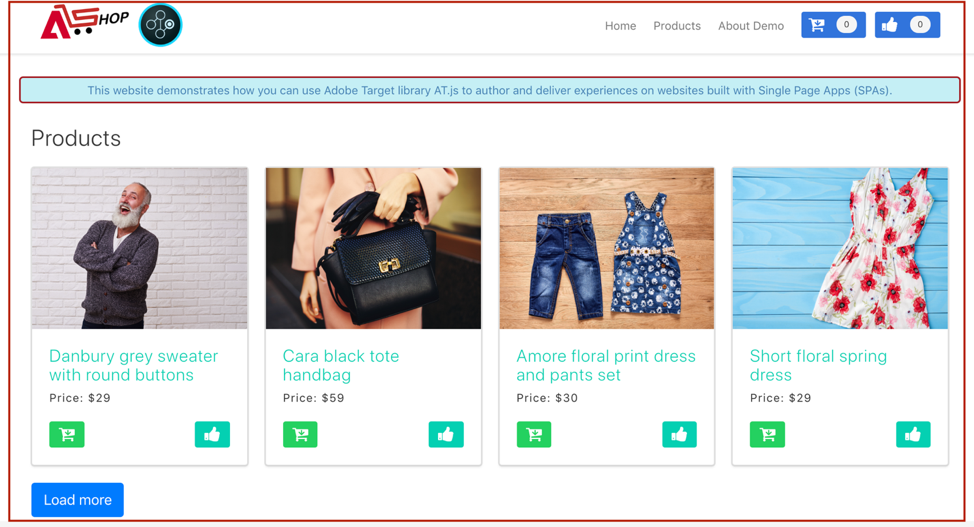
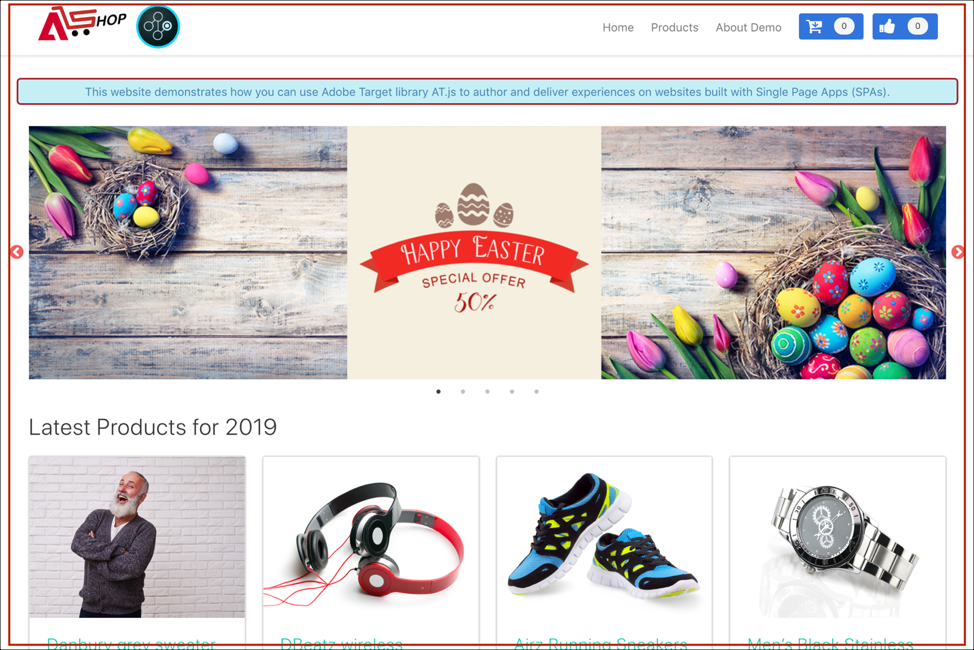

# 實作單頁應用程式

傳統的網站採用「頁面至頁面」導覽模型 (又稱為「多頁應用程式」)，網站設計與 URL 緊密結合，而從某網頁轉換到另一個網頁，需要頁面載入。單頁應用程式 (SPA) 這類新式 Web 應用程式採用的模型，則可加速瀏覽器 UI 演算速度，且通常與頁面重新載入無關。這些體驗通常會透過客戶互動觸發，例如捲動、點按和游標動作。隨著現代網路環境的不斷演進，傳統的一般事件 (例如頁面載入) 與部署個人化與實驗法之間的相關性已失效。


at.js 2.x 提供豐富的功能，讓貴公司能以新世代用戶端技術為基礎進行個人化。此版本著重於改善 at.js 與 SPA 之間的協調互動。

以下為使用 at.js 2.x 可享有但舊版不提供的優點:

* 可在頁面載入時快取所有選件，以減少對單一伺服器呼叫發出的多個伺服器呼叫。
* 顯著改善網站使用者體驗，因為可透過快取立即顯示選件，而不會發生傳統伺服器呼叫造成的時間延遲。
* 簡單的單行程式碼和一次性開發人員設定，讓行銷人員可透過 VEC 在 SPA 上建立和執行 A/B 和體驗目標鎖定 (XT) 活動。

## [!DNL Adobe Target]個檢視和單頁應用程式

適用於SPA的[!DNL Adobe Target] VEC充分利用「檢視」的新概念：視覺化元素的邏輯群組，共同構成SPA體驗。 因此，SPA 可以視為根據使用者互動轉換檢視，而不是轉換 URL。檢視通常可代表整個網站或網站內的分組視覺元素。

為了進一步說明檢視，讓我們瀏覽這個在React中實作的假想線上電子商務網站，並探索一些檢視範例。 按一下底下的連結，在新的瀏覽器分頁中開啓此網站。

**連結： [主網站](https://target.enablementadobe.com/react/demo/#/)**


導覽至首頁時，可以馬上看到宣傳復活節特賣活動的主圖影像，以及網站上販售的最新產品。在這個案例中，檢視可定義為整個首頁。請記下這點，因為我們將在下面的「實作[!DNL Adobe Target]檢視」一節中更深入說明。

**連結： [產品網站](https://target.enablementadobe.com/react/demo/#/products)**



由於我們對這間商店販賣的產品越來越感興趣，因此決定按一下「產品」連結。與首頁相似，產品網站整體可定義為一個檢視。我們可以將這個檢視命名為「products」，就像 `https://target.enablementadobe.com/react/demo/#/products)` 中的路徑名稱一樣。


本節的一開始，我們將檢視定義為整個網站或網站上的一組視覺元素。如上所示，網站上顯示的四個產品也可分組並視為檢視。如果想對這個檢視命名，可以將它命名為「Products」。


我們決定按一下「載入更多」按鈕，探索這個網站上的更多產品。在此情況下，網站 URL 不會變更。但此處的檢視只能呈現上圖中的第二列產品。該檢視的名稱可為「PRODUCTS-PAGE-2」。

**連結： [結帳](https://target.enablementadobe.com/react/demo/#/checkout)**


因為我們喜歡網站上展示的一些產品，所以決定購買幾項產品。現在，結帳網站提供我們幾個選項，可選擇一般配送或快捷配送。因為檢視可為網站上的任何一組視覺元素，因此可將這個檢視命名為「View Delivery Preferences」。

此外，檢視概念還可進一步延伸。如果行銷人員想要根據選取的配送偏好設定個人化網站內容，可針對每個配送偏好設定建立一個檢視。在這種情況下，當選取了「一般配送」時，就可以將檢視命名為「一般配送」。如果選取「快捷配送」，就可以將檢視命名為「快捷配送」。

假設現在行銷人員想執行 A/B 測試，以瞭解當選取「快捷配送」時，相較於讓這兩種配送選項的按鈕均保持藍色，按鈕從藍色變為紅色是否能增加轉換次數。

## 實作[!DNL Adobe Target]檢視

我們已在上文中介紹[!DNL Adobe Target]次檢視，現在可以在[!DNL Target]中運用此概念，讓行銷人員透過VEC在SPA上執行A/B和XT測試。 進行測試需要一次性開發人員設定。以下逐一說明設定步驟。

1. 安裝 at.js 2。*x*。

   首先，我們需要安裝at.js 2.*x* 使用供跨網域追蹤功能時。 這個at.js版本是針對SPA所開發。 舊版at.js不支援[!DNL Adobe Target]檢視和適用於SPA的VEC。

   下載at.js 2.透過&#x200B;**[!UICONTROL Administration]** > **[!UICONTROL Implementation]**&#x200B;中的[!DNL Adobe Target] UI *x*。 at.js 2.*x*&#x200B;也可以透過[!DNL Adobe Experience Platform]中的標籤進行部署。

1. 實作at.js 2.*x*&#x200B;函式，`[triggerView()](/help/dev/implement/client-side/atjs/atjs-functions/adobe-target-triggerview-atjs-2.md)`在您網站上。

   定義您要執行A/B或XT測試的SPA的檢視後，請實作at.js 2.*x* `triggerView()`函式，其檢視已傳入做為引數。 這麼做可讓行銷人員針對已定義檢視，使用 VEC 設計和執行的 A/B 和 XT 測試。如果沒有針對這些檢視定義 `triggerView()` 函數，VEC 將無法偵測檢視，進而導致行銷人員無法使用 VEC 來設計和執行 A/B 和 XT 測試。

   >[!NOTE]
   >
   >如需at.js的檢視支援，[viewsEnabled](/help/dev/implement/client-side/atjs/atjs-functions/targetglobalsettings.md#viewsenbabled)必須設定為true，否則所有檢視功能都會停用。

   **`adobe.target.triggerView(viewName, options)`**

   | 參數 | 類型 | 必要? | 驗證 | 說明 |
   | --- | --- | --- | --- | --- |
   | viewName | 字串 | 是 | 1. 尾端無空格。<br />2.不得空白。<br />3.所有頁面的檢視名稱都不得重複。<br />4.**警告**: 檢視名稱的開頭或結尾不能為「`/`」。這是因為客戶通常會從 URL 路徑中擷取檢視名稱。對我們來說，「home」和「`/home`」是不一樣的。<br />5.**警告**: 同一個檢視不應使用 `{page: true}` 選項連續觸發多次。 | 傳入任何名稱作為要代表檢視的字串類型。此檢視名稱會顯示在VEC的&#x200B;**[!UICONTROL Modifications]**&#x200B;面板中，供行銷人員建立動作和執行其A/B和XT活動。 |
   | options | 物件 | 無 |  |  |
   | options > page | 布林值 | 無 |  | **TRUE:** 頁面的預設值為 true。當 `page=true`，會傳送通知至 Edge 伺服器以增加曝光計數。<br />**FALSE**：當`page=false`時，將不會傳送通知以增加曝光計數。 只有當您想重新呈現頁面上含有某個選件的元件時，才應使用此項目。 |

   現在，讓我們來看看一些使用範例，瞭解如何在React中叫用假設性的電子商務SPA的`triggerView()`函式：

   **連結： [主網站](https://target.enablementadobe.com/react/demo/#/)**

   

   行銷人員如果想在整個首頁上執行 A/B 測試，可以將該檢視命名為「home」:

```
 function targetView() {
   var viewName = window.location.hash; // or use window.location.pathName if router works on path and not hash

   viewName = viewName || 'home'; // view name cannot be empty

   // Sanitize viewName to get rid of any trailing symbols derived from URL
   if (viewName.startsWith('#') || viewName.startsWith('/')) {
     viewName = viewName.substr(1);
   }

   // Validate if the Target Libraries are available on your website
   if (typeof adobe != 'undefined' && adobe.target && typeof adobe.target.triggerView === 'function') {
     adobe.target.triggerView(viewName);
   }
 }

 // react router v4
 const history = syncHistoryWithStore(createBrowserHistory(), store);
 history.listen(targetView);

 // react router v3
 <Router history={hashHistory} onUpdate={targetView} >
```

**連結： [產品網站](https://target.enablementadobe.com/react/demo/#/products)**

現在，讓我們來看看更複雜的範例。 假設我們是行銷人員，我們想在使用者按一下「載入更多」按鈕後，將「價格」標籤的顏色變更為紅色，以個人化產品的第二列。


```
 function targetView(viewName) {
   // Validate if the Target Libraries are available on your website
   if (typeof adobe != 'undefined' && adobe.target && typeof adobe.target.triggerView === 'function') {
     adobe.target.triggerView(viewName);
   }
 }

 class Products extends Component {
   render() {
     return (
       <button type="button" onClick={this.handleLoadMoreClicked}>Load more</button>
     );
   }

   handleLoadMoreClicked() {
     var page = this.state.page + 1; // assuming page number is derived from component's state
     this.setState({page: page});
     targetView('PRODUCTS-PAGE-' + page);
   }
 }
```

**連結： [結帳](https://target.enablementadobe.com/react/demo/#/checkout)**


如果行銷人員想要根據選取的配送偏好設定個人化網站內容，可針對每個配送偏好設定建立一個檢視。在這種情況下，當選取了「一般配送」時，就可以將檢視命名為「一般配送」。如果選取「快捷配送」，就可以將檢視命名為「快捷配送」。

假設現在行銷人員想執行 A/B 測試，以瞭解當選取「快捷配送」時，相較於讓這兩種配送選項的按鈕均保持藍色，按鈕從藍色變為紅色是否能增加轉換次數。

```
 function targetView(viewName) {
   // Validate if the Target Libraries are available on your website
   if (typeof adobe != 'undefined' && adobe.target && typeof adobe.target.triggerView === 'function') {
     adobe.target.triggerView(viewName);
   }
 }

 class Checkout extends Component {
   render() {
     return (
       <div onChange={this.onDeliveryPreferenceChanged}>
         <label>
           <input type="radio" id="normal" name="deliveryPreference" value={"Normal Delivery"} defaultChecked={true}/>
           <span> Normal Delivery (7-10 business days)</span>
         </label>

         <label>
           <input type="radio" id="express" name="deliveryPreference" value={"Express Delivery"}/>
           <span> Express Delivery* (2-3 business days)</span>
         </label>
       </div>
     );
   }
   onDeliveryPreferenceChanged(evt) {
     var selectedPreferenceValue = evt.target.value;
     targetView(selectedPreferenceValue);
   }
 }
```

## at.js 2.x 系統圖表

下列圖表可協助您瞭解 at.js 2.x 搭配檢視的工作流程，以及如何藉由這套工作流程增強 SPA 整合。如需 at.js 2.x 中所使用概念的詳細介紹，請參閱[實作單頁應用程式](/help/dev/implement/client-side/atjs/how-to-deployatjs/target-atjs-single-page-application.md)。


| 步驟 | 詳細資料 |
| --- | --- |
| 1 | 如果使用者已驗證，呼叫會傳回Experience CloudID；另一個呼叫會同步客戶ID。 |
| 2 | at.js 程式庫會同步載入並隱藏文件本文。<br />也能使用將頁面上實作的程式碼片段預先隱藏的選項，以非同步方式載入 at.js。 |
| 3 | 提出頁面載入要求，包含所有已設定的參數 (MCID、SDID 和客戶 ID)。 |
| 4 | 個人資料指令碼執行，然後注入個人資料存放區。存放區會從客群資料庫中請求合格客群 (例如，從 Adobe Analytics、客群管理等共用的客群)。<br />客戶屬性會透過批次程序傳送至個人資料存放區。 |
| 5 | [!DNL Target] 會根據 URL 要求參數和個人資料，決定可針對目前頁面和未來檢視傳回哪些活動和體驗給訪客。 |
| 6 | 目標內容會傳回至頁面，選擇性地包括其他個人化的個人資料值。<br />目前頁面上目標內容會儘快出現，不會有忽隱忽現的預設內容。<br />針對在瀏覽器中快取的使用者 SPA 動作顯示檢視的目標內容，以便在透過 `triggerView()` 觸發檢視時立刻套用，不需額外的伺服器呼叫。 |
| 7 | Analytics 資料傳送至「資料收集」伺服器。 |
| 8 | 目標資料透過SDID符合[!DNL Analytics]資料，且已處理至[!DNL Analytics]報表儲存體。然後就可以在[!DNL Target] (A4T)報表的[!DNL Analytics]與[!DNL Target]中，透過[!DNL Analytics]檢視<br />分析資料。 |

現在，SPA 上只要是有實作 `triggerView()` 的位置，系統都會從快取擷取檢視和動作並向使用者顯示，不需要伺服器呼叫。`triggerView()` 也會對 [!DNL Target] 後端發出通知要求，以便增加和記錄曝光計數。


| 步驟 | 詳細資料 |
| --- | --- |
| 1 | 系統在 SPA 中呼叫 `triggerView()`，以便呈現檢視和套用動作來修改視覺元素。 |
| 2 | 從快取讀取檢視的目標內容。 |
| 3 | 目標內容會儘快出現，不會有忽隱忽現的預設內容。 |
| 4 | 通知要求會傳送至 [!DNL Target] 個人資料存放區，以計算活動中的訪客數和增加量度。 |
| 5 | Analytics 資料傳送至資料收集伺服器。 |
| 6 | 目標資料透過SDID與[!DNL Analytics]資料相符，並處理至[!DNL Analytics]報表儲存體。 然後就可以透過A4T報表在[!DNL Analytics]和[!DNL Target]中檢視[!DNL Analytics]資料。 |

## 單一頁面應用程式可視化體驗撰寫器

安裝 at.js 2.x 並將 `triggerView()` 新增至您的網站後，請使用 VEC 執行 A/B 和 XT 活動。如需詳細資訊，請參閱[單頁應用程式 (SPA) 可視化體驗撰寫器](https://experienceleague.adobe.com/docs/target/using/experiences/spa-visual-experience-composer.html?lang=zh-Hant)。

>[!NOTE]
>
>適用於 SPA 的 VEC 與您用於一般網頁的 VEC 完全相同，不過當您開啟實作了 `triggerView()` 的單頁應用程式時，會提供一些額外功能讓您使用。

## 使用TriggerView，確保A4T可搭配at.js 2.x和SPA正常運作

若要確保[Analytics for Target](https://experienceleague.adobe.com/docs/target/using/integrate/a4t/a4t.html?lang=zh-Hant) (A4T)可搭配at.js 2.x正常運作，請務必在[!DNL Target]要求和[!DNL Analytics]要求中傳送相同的SDID。

SPA 相關最佳實務如下:

* 使用自訂事件通知應用程式中發生了有趣的內容
* 在檢視開始呈現前觸發自訂事件
* 在檢視完成呈現時觸發自訂事件

at.js 2.x 已新增新的 API [triggerView()](/help/dev/implement/client-side/atjs/atjs-functions/adobe-target-triggerview-atjs-2.md) 函數。您應使用 `triggerView()` 通知 at.js 檢視將開始呈現。

若要查看如何合併自訂事件、at.js 2.x 和 Analytics，請參考以下範例。此範例假設 HTML 頁面包含訪客 API，隨後是 at.js 2.x，隨後是 AppMeasurement。

假設存在下列自訂事件:

* `at-view-start` - 檢視開始呈現時
* `at-view-end` - 檢視完成呈現時

若要確保 A4T 可搭配 at.js 2.x 正常運作，

檢視開始處理常式應如下所示:

```jsx {line-numbers="true"}
document.addEventListener("at-view-start", function(e) {
  var visitor = Visitor.getInstance("<your Adobe Org ID>");
  
  visitor.resetState();
  adobe.target.triggerView("<view name>");
});
```

檢視結束處理常式應如下所示:

```jsx {line-numbers="true"}
document.addEventListener("at-view-end", function(e) {
  // s - is the AppMeasurement tracker object
  s.t();
});
```

>[!NOTE]
>
>您必須觸發 `at-view-start` 和 `at-view-end` 事件。這些事件不是 at.js 自訂事件的一部分。

雖然這些範例使用JavaScript程式碼，但如果您使用標籤管理員(例如[Adobe Experience Platform](/help/dev/implement/client-side/atjs/how-to-deployatjs/implement-target-using-adobe-launch.md)中的標籤)，這一切都能簡化。

如果您按照上述步驟進行，您應該能擁有適用於 SPA 的健全 A4T 解決方案。

## 實作最佳實務

at.js 2.x API可讓您以多種方式自訂您的[!DNL Target]實作，但在此過程中務必要遵循正確的作業順序。

下列資訊說明在瀏覽器中首次載入單頁應用程式時，以及之後發生的任何檢視變更必須遵循的作業順序。

### 初始頁面載入的作業順序 {#order}

| 步驟 | Action | 詳細資料 |
| --- | --- | --- |
| 1 | 載入訪客API JS | 此程式庫負責將ECID指派給訪客。 此ID稍後由網頁上的其他Adobe解決方案使用。 |
| 2 | 載入at.js 2.x | at.js 2.x載入您用來實作[!DNL Target]要求與檢視的所有必要API。 |
| 3 | 執行[!DNL Target]要求 | 如果您有資料層，建議您在執行[!DNL Target]要求之前，先載入傳送至[!DNL Target]所需的關鍵資料。 這可讓您使用`targetPageParams`來包含您要用於定位的任何資料。<P>當[targetGlobalSettings](/help/dev/implement/client-side/atjs/atjs-functions/targetglobalsettings.md)中的`pageLoadEnabled`和`viewsEnabled`設定為true時，at.js會在步驟2中自動要求您使用所有VEC [!DNL Target]選件。<P>請注意，頁面載入後，`getOffers`也可用來取得VEC選件。 若要這麼做，請確定請求在API呼叫中包含`execute>pageLoad`和`prefetch>views`。 |
| 4 | 撥打`triggerView()` | 由於您在步驟3起始的[!DNL Target]要求可能會傳回頁面載入執行與檢視的體驗，請確定在傳回[!DNL Target]要求之後呼叫`triggerView()`，並完成將選件套用至快取。 每個檢視只可執行此步驟一次。 |
| 5 | 呼叫[!DNL Analytics]頁面檢視信標 | 此信標會將與步驟3和4相關聯的SDID傳送至[!DNL Analytics]以進行資料拼接。 |
| 6 | 撥打其他`triggerView({"page": false})` | 這是SPA架構的選用步驟，可能會重新呈現頁面上的特定元件，而不會發生檢視變更。 在這種情況下，請務必叫用此API，以確保在SPA架構重新轉譯元件後重新套用[!DNL Target]體驗。 您可以不限次數地執行此步驟，以確保[!DNL Target]個體驗持續保留在您的SPA檢視中。 |

### SPA檢視變更的作業順序（無全頁重新載入）

| 步驟 | Action | 詳細資料 |
| --- | --- | --- |
| 1 | 撥打`visitor.resetState()` | 此API可確保在載入新檢視時為其重新產生SDID。 |
| 2 | 呼叫`getOffers()` API以更新快取 | 如果此檢視變更有可能讓目前的訪客符合更多[!DNL Target]活動的資格或讓他們失去活動的資格，則可以選擇執行此步驟。 此時，您也可以選擇傳送其他資料給[!DNL Target]，以啟用進一步的鎖定目標功能。 |
| 3 | 撥打`triggerView()` | 如果您已執行步驟2，則必須等候[!DNL Target]要求並套用選件至快取，才能執行此步驟。 每個檢視只可執行此步驟一次。 |
| 4 | 撥打`triggerView()` | 如果您尚未執行步驟2，則可以在完成步驟1後立即執行此步驟。 如果您已執行步驟2和步驟3，則應該略過此步驟。 每個檢視只可執行此步驟一次。 |
| 5 | 呼叫[!DNL Analytics]頁面檢視信標 | 此信標會將與步驟2、3和4相關聯的SDID傳送至[!DNL Analytics]以進行資料拼接。 |
| 6 | 撥打其他`triggerView({"page": false})` | 這是SPA架構的選用步驟，可能會重新呈現頁面上的特定元件，而不會發生檢視變更。 在這種情況下，請務必叫用此API，以確保在SPA架構重新轉譯元件後重新套用[!DNL Target]體驗。 您可以不限次數地執行此步驟，以確保[!DNL Target]個體驗持續保留在您的SPA檢視中。 |

## 訓練影片

以下影片包含更多資訊:

### 瞭解 at.js 2.x 的運作方式

>[!VIDEO](https://video.tv.adobe.com/v/26250/?quality=12)

如需詳細資訊，請參閱[&#x200B; 了解 at.js 2.x 的運作方式](https://experienceleague.adobe.com/docs/target-learn/tutorials/implementation/understanding-how-atjs-20-works.html?lang=zh-Hant)。

### 在 SPA 中實作 at.js 2.x

>[!VIDEO](https://video.tv.adobe.com/v/26248/?quality=12)

如需詳細資訊，請參閱[在單頁應用程式(SPA)中實作Adobe Target的at.js 2.x &#x200B;](https://experienceleague.adobe.com/docs/target-learn/tutorials/experiences/use-the-visual-experience-composer-for-single-page-applications.html?lang=zh-Hant)。

### 在[!DNL Adobe Target]中使用適用於SPA的VEC

>[!VIDEO](https://video.tv.adobe.com/v/26249/?quality=12)

如需詳細資訊，請參閱[在Adobe Target](https://experienceleague.adobe.com/docs/target-learn/tutorials/experiences/use-the-visual-experience-composer-for-single-page-applications.html?lang=zh-Hant)中使用適用於單頁應用程式的視覺化體驗撰寫器(SPA VEC)。
