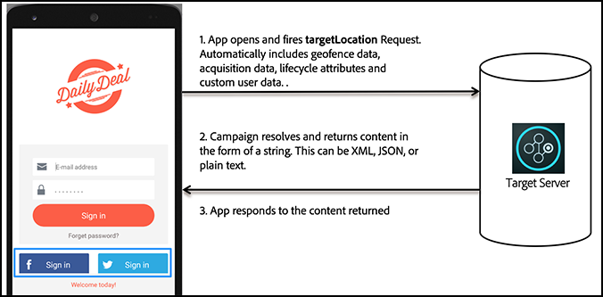

# [!DNL Target]在行動應用程式中如何運作

[!DNL Adobe Mobile SDK]連絡[!DNL Target]伺服器以取得內容以及其他資料點，向使用者顯示正確的體驗。

>[!IMPORTANT]
>
>支援[!DNL Adobe Mobile]版本4。*x* SDK已於2021年8月31日結束，不建議再供[!DNL Adobe Target]個行動使用者使用。
>
>[適用於行動應用程式的Adobe Experience Platform SDK](https://developer.adobe.com/client-sdks/documentation/){target=_blank}是支援行動應用程式中[!DNL Adobe Experience Cloud]解決方案和服務的建議解決方案。

## [!DNL Target]個位置和成功量度

*目標位置*&#x200B;又稱為 mbox。應用程式中識別的位置可供測試或個人化 (例如，主畫面的歡迎訊息)。測試建立程序期間會識別這些位置。

*[成功量度](https://experienceleague.adobe.com/docs/target/using/activities/success-metrics/success-metrics.html)*&#x200B;是使用者執行的動作，可識別特定活動是否成功（例如註冊、購物、訂票等）。

* **[!DNL Target]位置：**&#x200B;顯示在登入按鈕下方的內容。

  此特定使用者在下午 6 點以前免運費。此位置可在多個[!DNL Target]活動中重複使用，以執行A/B測試和個人化。

* **成功量度：**&#x200B;使用者點選註冊按鈕時所執行的動作。

**瞭解[!DNL Target]在SDK中的運作方式**

