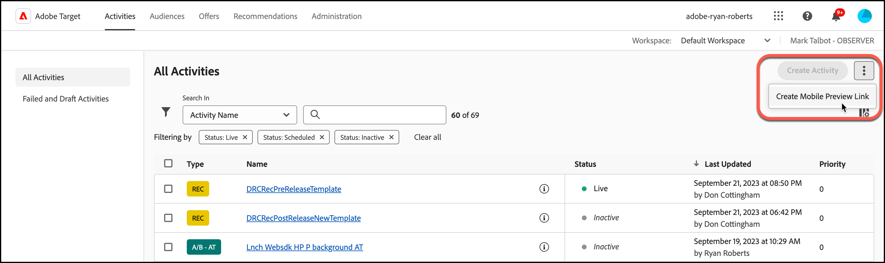
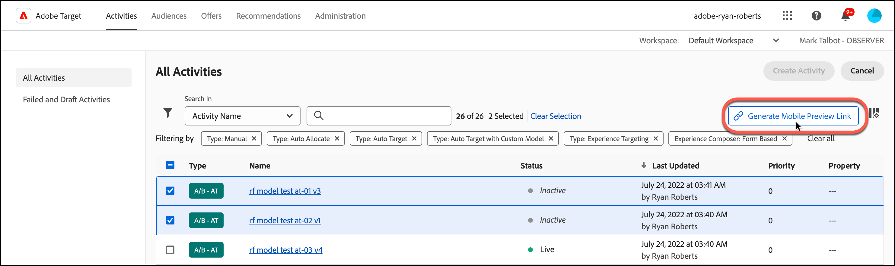
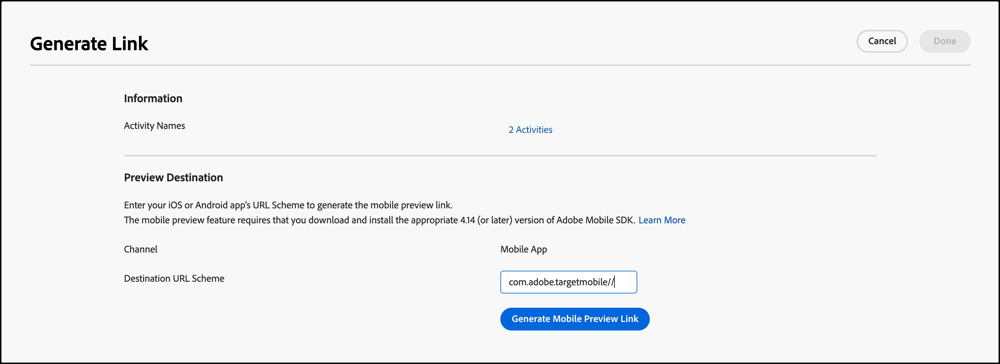
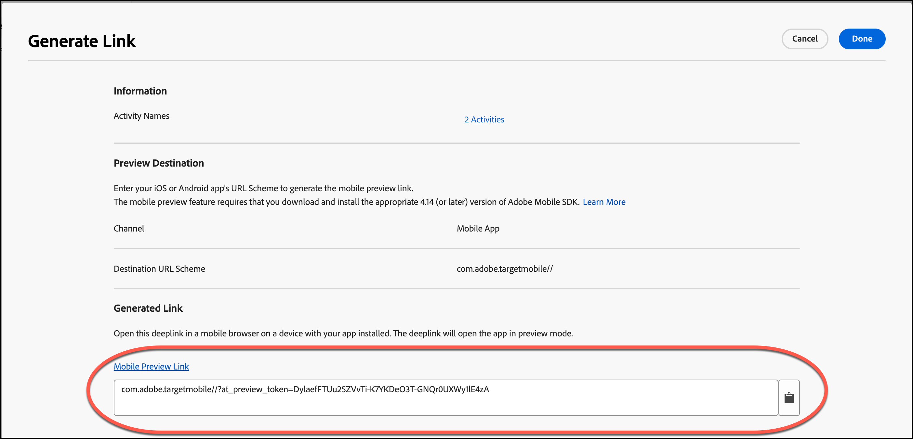
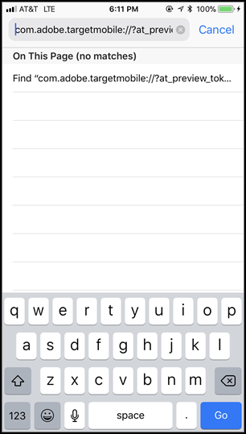
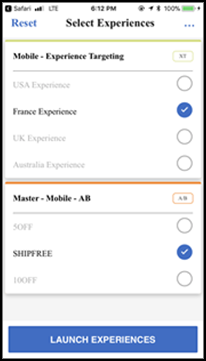

# [!DNL Target] 行動裝置預覽

使用行動裝置預覽連結為行動應用程式活動執行簡單的端對端品質確保措施，並且無需任何特殊測試裝置，即可在您的裝置上註冊不同的體驗。

## 總覽

行動裝置預覽功能可讓您在讓活動上線啟動之前，完整測試您的行動應用程式活動。

## 必要條件

1. **使用支援的SDK版本：** 行動裝置預覽功能需要您下載適當版本的Adobe Mobile SDK，並安裝在您對應的應用程式中。

   如需下載適當SDK的說明，請參閱 [目前SDK版本](https://developer.adobe.com/client-sdks/documentation/current-sdk-versions/){target=_blank} 在 *[!DNL Adobe Experience Platform Mobile SDK]* 檔案。

1. **設定 URL 配置:** 預覽連結使用 URL 配置來開啟您的應用程式。您必須針對預覽指定唯一的 URL 配置。

   如需詳細資訊，請參閱 [視覺預覽](https://developer.adobe.com/client-sdks/documentation/adobe-target/#visual-preview){target=_blank} 在 *Adobe Target* 在 *[!DNL Adobe Experience Platform Mobile SDK]* 檔案。

   下列連結包含更多資訊：

   * **iOs**：如需為iOS設定URL配置的詳細資訊，請參閱 [為您的應用程式定義自訂URL配置](https://developer.apple.com/documentation/xcode/defining-a-custom-url-scheme-for-your-app){target=_blank} (位於Apple開發人員網站)。
   * **Android**：如需為Android設定URL配置的詳細資訊，請參閱 [建立應用程式內容的深層連結](https://developer.android.com/training/app-links/deep-linking){target=_blank} Android開發人員網站上的資訊。

1. **設定 `collectLaunchInfo` API （僅限i0S）**

   如需詳細資訊，請參閱 [視覺預覽](https://developer.adobe.com/client-sdks/documentation/adobe-target/#visual-preview){target=_blank} 在 *Adobe Target* 在 *[!DNL Adobe Experience Platform Mobile SDK]* 檔案。

## 產生預覽連結

1. 在 [!DNL Target] UI，按一下 **[!UICONTROL 更多選項]** 圖示（垂直省略符號），然後選取「 」 **[!UICONTROL 建立行動裝置預覽]**.

   

1. 選取您要預覽的活動，然後按一下 **[!UICONTROL 產生行動裝置預覽連結]**.

   >[!NOTE]
   >
   >僅能選取表單式 AB 和 XT 活動。

   

1. 指定您應用程式的 URL 配置。

   這需要與您 iOS 或 Android 應用程式中所呈現的內容相同。分別對 iOS 和 Android 重複此程序 (如必要)。

   

1. 按一下&#x200B;**[!UICONTROL 「產生行動裝置預覽連結」]**，然後複製連結。

   

## 在您的裝置上預覽

在您安裝應用程式所在裝置上的行動瀏覽器中開啟連結。此應用程式可以是您從 Apple App Store 或 Google Play 商店下載的生產應用程式。不需要是某個特殊版本。如果您有使用中預覽連結，將可以在裝置上檢視體驗。

1. 在您的行動瀏覽器中開啟連結。

   分享您在上一步中複製的連結(從 [!DNL Target] 以方便的方式將UI連線至行動裝置，例如使用文字、電子郵件或Slack。

   |||

   您的應用程式隨即開啟並啟動 [!DNL Target] 行動裝置預覽模式。

1. 選取您要查看的體驗組合，然後按一下&#x200B;**[!UICONTROL 「啟動體驗」]**。

   ||||
||||

## 限制

* 按一下&#x200B;**[!UICONTROL 「啟動體驗」]**&#x200B;按鈕之後，必須重新載入檢視新內容才會顯示。最容易的方式是切換至不同畫面，然後回到您預期會發生變更的畫面。
* Android 早於 API-19 (KitKat) 的版本不支援行動裝置預覽。
