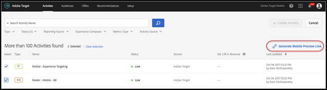
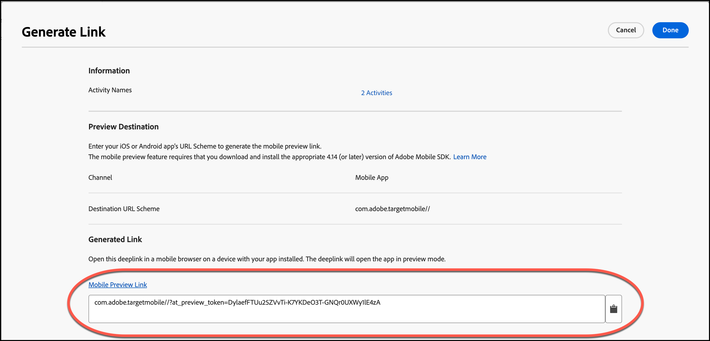
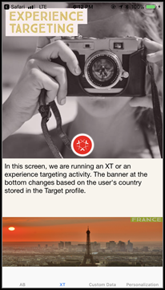
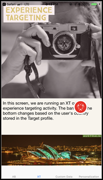

# [!DNL Target]行動裝置預覽

使用行動裝置預覽連結可針對行動應用程式活動執行簡單的端對端品質保證，並且無需任何特殊測試裝置，即可在使用裝置的情況下註冊不同的體驗。

行動裝置預覽功能可讓您在啟動行動應用程式活動之前，完整測試這些活動。

## 先決條件

1. **使用支援的SDK版本：**&#x200B;行動裝置預覽功能需要您下載適當版本的[!DNL Adobe Mobile SDK]，並安裝在您對應的應用程式中。

   如需下載適當SDK的說明，請參閱&#x200B;*[!DNL Adobe Experience Platform Mobile SDK]*&#x200B;檔案中的[目前的SDK版本](https://developer.adobe.com/client-sdks/documentation/current-sdk-versions/){target=_blank}。

1. **設定 URL 配置:** 預覽連結使用 URL 配置來開啟您的應用程式。 指定預覽的唯一URL配置。

   如需詳細資訊，請參閱&#x200B;*[!DNL Mobile SDK]*&#x200B;檔案中&#x200B;*在資料連線UI*&#x200B;中設定Target擴充功能[視覺預覽](https://developer.adobe.com/client-sdks/documentation/adobe-target/#visual-preview){target=_blank}。

   下列連結包含更多資訊：

   * **iOs**：如需為iOS設定URL配置的詳細資訊，請參閱[在&#x200B;*Apple Developer*&#x200B;網站上為您的應用程式](https://developer.apple.com/documentation/xcode/defining-a-custom-url-scheme-for-your-app){target=_blank}定義自訂URL配置。
   * **Android**：如需設定Android URL配置的詳細資訊，請參閱&#x200B;*Android開發人員*&#x200B;網站上的[建立應用程式內容的深層連結](https://developer.android.com/training/app-links/deep-linking){target=_blank}。

1. **設定`collectLaunchInfo` API （僅限i0S）**

   如需詳細資訊，請參閱&#x200B;*[!DNL Mobile SDK]*&#x200B;檔案中&#x200B;*在資料連線UI*&#x200B;中設定Target擴充功能[視覺預覽](https://developer.adobe.com/client-sdks/documentation/adobe-target/#visual-preview){target=_blank}。

## 產生預覽連結

1. 在[!DNL Target] UI中，按一下&#x200B;**[!UICONTROL 更多選項]**&#x200B;圖示（垂直省略符號），然後選取&#x200B;**[!UICONTROL 建立行動裝置預覽連結]**。

   

1. 選取您要預覽的活動，然後按一下[產生行動裝置預覽連結]。**&#x200B;**

   >[!NOTE]
   >
   >您只能選取表單式[!UICONTROL A/B測試]和[!UICONTROL 體驗鎖定目標] (XT)活動。

   

1. 指定您應用程式的 URL 配置。

   URL配置必須與iOS或Android應用程式中存在的相同。 如有必要，請分別對iOS和Android重複此程式。

   

1. 按一下&#x200B;**[!UICONTROL 「產生行動裝置預覽連結」]**，然後複製連結。

   

## 在您的裝置上預覽

在您安裝應用程式所在裝置上的行動瀏覽器中開啟連結。 此應用程式可以是您從[!DNL Apple App Store]或[!DNL Google Play Store]下載的生產應用程式。 應用程式不需要是特殊的組建。 如果您有作用中的預覽連結，則可以在裝置上檢視體驗。

1. 在您的行動瀏覽器中開啟連結。

   以方便的方式共用您在上一節從[!DNL Target] UI複製到行動裝置的連結，例如使用文字、電子郵件或[!DNL Slack]。

   |||

   您的應用程式會開啟並啟動[!DNL Target] [!UICONTROL 行動裝置預覽模式]。

1. 選取您要查看的體驗組合，然後按一下&#x200B;**[!UICONTROL 「啟動體驗」]**。

   ||||
||||

## 限制

* 按一下&#x200B;**[!UICONTROL 「啟動體驗」]**&#x200B;按鈕之後，必須重新載入檢視新內容才會顯示。 最容易的方式是切換至不同畫面，然後回到您預期會發生變更的畫面。
* Android 早於 API-19 (KitKat) 的版本不支援行動裝置預覽。
