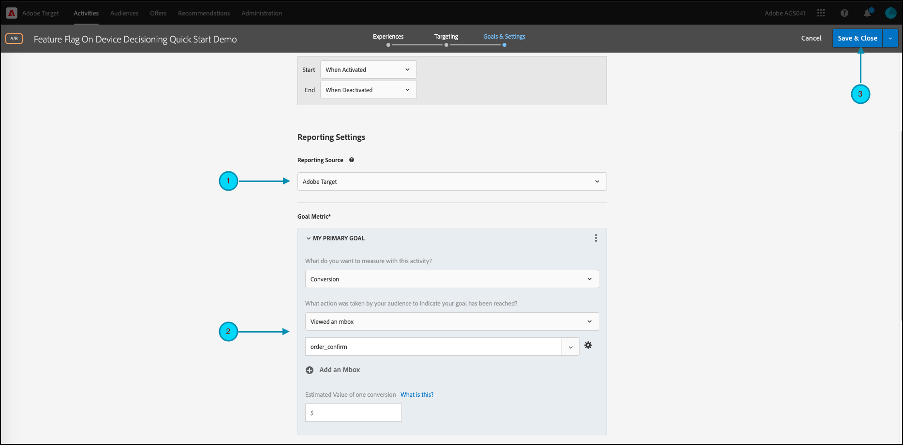

# 開始使用[!DNL Target] SDK

為了啟動並執行，我們鼓勵您以您選擇的語言建立您的第一個[裝置上決策](../on-device-decisioning/overview.md)功能標幟活動：

* Node.js
* Java
* .NET
* Python

## 步驟摘要

1. 為您的組織啟用裝置上決策
1. 安裝SDK
1. 初始化SDK
1. 在[!DNL Adobe Target] [!UICONTROL A/B Test]活動中設定功能標幟
1. 在您的應用程式中實作及演算功能
1. 實施應用程式中事件的追蹤
1. 啟用您的[!UICONTROL A/B Test]活動

## 1.為您的組織啟用裝置上決策

啟用裝置上決策可確保在幾乎零延遲的情況下執行[!UICONTROL A/B Test]活動。 若要啟用此功能，請瀏覽至「**[!UICONTROL Administration]** > **[!UICONTROL Implementation]** > **[!UICONTROL Account details]**」並啟用「**[!UICONTROL On-Device Decisioning]**」切換按鈕。


>[!NOTE]
>
>您必須擁有&#x200B;**[!UICONTROL Admin]**&#x200B;或&#x200B;**[!UICONTROL Approver]** [使用者角色](https://experienceleague.adobe.com/docs/target/using/administer/manage-users/user-management.html)，才能啟用或停用&#x200B;**[!UICONTROL On-Device Decisioning]**&#x200B;切換功能。

啟用&#x200B;**[!UICONTROL On-Device Decisioning]**&#x200B;切換後，[!DNL Adobe Target]會開始為您的使用者端產生[規則成品](../on-device-decisioning/rule-artifact-overview.md)。

## 2.安裝SDK

對於Node.js、Java和Python，請在終端機的專案目錄中執行以下命令。 針對.NET，請由[從NuGet](https://www.nuget.org/packages/Adobe.Target.Client)安裝以將其新增為相依性。

>[!BEGINTABS]

>[!TAB Node.js (NPM)]

```js {line-numbers="true"}
npm i @adobe/target-nodejs-sdk -P
```

>[!TAB Java (Maven)]

```javascript {line-numbers="true"}
<dependency>
   <groupId>com.adobe.target</groupId>
   <artifactId>java-sdk</artifactId>
   <version>2.0</version>
</dependency>
```

>[!TAB .NET (Bash)]

```bash {line-numbers="true"}
dotnet add package Adobe.Target.Client
```

>[!TAB Python (pip)]

```python {line-numbers="true"}
pip install target-python-sdk
```

>[!ENDTABS]

## 3.初始化SDK

規則成品會在SDK初始化步驟期間下載。 您可以自訂初始化步驟，以決定如何下載及使用成品。

>[!BEGINTABS]

>[!TAB Node.js]

```js {line-numbers="true"}
const TargetClient = require("@adobe/target-nodejs-sdk");

const CONFIG = {
   client: "<your target client code>",
   organizationId: "your EC org id",
   decisioningMethod: "on-device",
   events: {
      clientReady: targetClientReady
      }
};

const tClient = TargetClient.create(CONFIG);

function targetClientReady() {
   //Adobe Target SDK has now downloaded the JSON artifact locally, which contains the activity details.
   //We will see how to use the artifact here very soon.
}
```

>[!TAB Java (Maven)]

```javascript {line-numbers="true"}
ClientConfig config = ClientConfig.builder()
   .client("testClient")
   .organizationId("ABCDEF012345677890ABCDEF0@AdobeOrg")
   .build();
TargetClient targetClient = TargetClient.create(config);
```

>[!TAB .NET (C#)]

```csharp {line-numbers="true"}
var targetClientConfig = new TargetClientConfig.Builder("testClient", "ABCDEF012345677890ABCDEF0@AdobeOrg")
   .Build();
this.targetClient.Initialize(targetClientConfig);
```

>[!TAB Python]

```python {line-numbers="true"}
from target_python_sdk import TargetClient

def target_client_ready():
   # Adobe Target SDK has now downloaded the JSON artifact locally, which contains the activity details.
   # We will see how to use the artifact here very soon.

CONFIG = {
   "client": "<your target client code>",
   "organization_id": "your EC org id",
   "decisioning_method": "on-device",
   "events": {
      "client_ready": target_client_ready
   }
}

target_client = TargetClient.create(CONFIG)
```

>[!ENDTABS]

## 4.在[!DNL Adobe Target] [!UICONTROL A/B Test]活動中設定功能標幟

1. 在[!DNL Target]中，導覽至&#x200B;**[!UICONTROL Activities]**&#x200B;頁面，然後選取&#x200B;**[!UICONTROL Create Activity]** > **[!UICONTROL A/B test]**。

   

1. 在&#x200B;**[!UICONTROL Create A/B Test Activity]**&#x200B;強制回應視窗中，保留預設的Web選項為已選取(1)、選取&#x200B;**[!UICONTROL Form]**&#x200B;作為您的體驗撰寫器(2)、選取具有&#x200B;**[!UICONTROL No Property Restrictions]**(3)的&#x200B;**[!UICONTROL Default Workspace]**，然後按一下&#x200B;**[!UICONTROL Next]** (4)。

   

1. 在活動建立的&#x200B;**[!UICONTROL Experiences]**&#x200B;步驟中，提供活動的名稱(1)並新增第二個體驗，體驗B，方法是按一下&#x200B;**[!UICONTROL Add Experience]** (2)。 輸入您選擇的地點名稱(3)。 例如，`ondevice-featureflag`或`homepage-addtocart-featureflag`是表示功能標幟測試目的地的位置名稱。  在下列範例中，`ondevice-featureflag`是為體驗B定義的位置。您可以選擇新增對象細分(4)，以限制活動的資格。

   

1. 在相同頁面的&#x200B;**[!UICONTROL CONTENT]**&#x200B;區段中，選取下拉式清單(1)中的&#x200B;**[!UICONTROL Create JSON Offer]**，如圖所示。

   

1. 在出現的&#x200B;**[!UICONTROL JSON Data]**&#x200B;文字方塊中，使用有效的JSON物件(2)為每個體驗(1)輸入您的功能標幟變數。

   輸入體驗A的功能標幟變數。

   

   **（以上體驗A的範例JSON）**

   ```json {line-numbers="true"}
   {
      "enabled" : true,
      "flag" : "expA"
   }
   ```

   輸入體驗B的功能標幟變數。

   

   **（體驗B的範例JSON，以上）**

   ```json {line-numbers="true"}
   {
      "enabled" : true,
      "flag" : "expB"
   }
   ```

1. 按一下&#x200B;**[!UICONTROL Next]** (1)以進入建立活動的&#x200B;**[!UICONTROL Targeting]**&#x200B;步驟。

   

1. 在下方所示的&#x200B;**[!UICONTROL Targeting]**&#x200B;步驟範例中，為了簡單起見，「對象鎖定目標」(2)會維持在「所有訪客」的預設集。 這表示活動未定位。 不過，附註Adobe建議您一律將目標定位為生產活動的對象。 按一下&#x200B;**[!UICONTROL Next]** (3)以進入建立活動的&#x200B;**[!UICONTROL Goals & Settings]**&#x200B;步驟。

   

1. 在&#x200B;**[!UICONTROL Goals & Settings]**&#x200B;步驟中，將&#x200B;**[!UICONTROL Reporting Source]**&#x200B;設為&#x200B;**[!UICONTROL Adobe Target]** (1)。 將&#x200B;**[!UICONTROL Goal Metric]**&#x200B;定義為&#x200B;**[!UICONTROL Conversion]**，根據您網站的轉換量度(2)指定詳細資料。 按一下&#x200B;**[!UICONTROL Save & Close]** (3)以儲存活動。

   

## 5.在您的應用程式中實作及呈現功能

在[!DNL Target]中設定功能標幟變數後，請修改您的應用程式程式碼以使用這些變數。 例如，在應用程式中取得功能標幟後，您可使用它來啟用功能並轉譯訪客符合資格的體驗。

>[!BEGINTABS]

>[!TAB Node.js]

```js {line-numbers="true"}
//... Code removed for brevity
​
let featureFlags = {};
​
function targetClientReady() {
   tClient.getAttributes(["ondevice-featureflag"]).then(function(response) {
      const featureFlags = response.asObject("ondevice-featureflag");
      if(featureFlags.enabled && featureFlags.flag !== "expA") { //Assuming "expA" is control
         console.log("Render alternate experience" + featureFlags.flag);
      }
      else {
         console.log("Render default experience");
      }
   });
}
```

>[!TAB Java (Maven)]

```javascript {line-numbers="true"}
MboxRequest mbox = new MboxRequest().name("ondevice-featureflag").index(0);
TargetDeliveryRequest request = TargetDeliveryRequest.builder()
   .context(new Context().channel(ChannelType.WEB))
   .execute(new ExecuteRequest().mboxes(Arrays.asList(mbox)))
   .build();
Attributes attributes = targetClient.getAttributes(request, "ondevice-featureflag");
String flag = attributes.getString("ondevice-featureflag", "flag");
```

>[!TAB .NET (C#)]

```csharp {line-numbers="true"}
var mbox = new MboxRequest(index: 0, name: "ondevice-featureflag");
var deliveryRequest = new TargetDeliveryRequest.Builder()
   .SetContext(new Context(ChannelType.Web))
   .SetExecute(new ExecuteRequest(mboxes: new List<MboxRequest> { mbox }))
   .Build();
var attributes = targetClient.GetAttributes(request, "ondevice-featureflag");
var flag = attributes.GetString("ondevice-featureflag", "flag");
```

>[!TAB Python]

```python {line-numbers="true"}
# ... Code removed for brevity

feature_flags = {}

def target_client_ready():
   attribute_provider = target_client.get_attributes(["ondevice-featureflag"])
   feature_flags = attribute_provider.as_object(mbox_name="ondevice-featureflag")
   if feature_flags.get("enabled") and feature_flags.get("flag") != "expA": # Assuming "expA" is control
      print("Render alternate experience {}".format(feature_flags.get("flag")))
   else:
      print("Render default experience")
```

>[!ENDTABS]

## 6.針對應用程式中的事件實作其他追蹤

您可以選擇使用sendNotification()函式傳送額外的事件以追蹤轉換。

>[!BEGINTABS]

>[!TAB Node.js]

```js {line-numbers="true"}
//... Code removed for brevity
​
//When a conversion happens
TargetClient.sendNotifications({
   targetCookie,
   "request" : {
      "notifications" : [
      {
         type: "display",
         timestamp : Date.now(),
         id: "conversion",
         mbox : {
            name : "orderConfirm"
         },
         order : {
            id: "BR9389",
            total : 98.93,
            purchasedProductIds : ["J9393", "3DJJ3"]
         }
      }
      ]
   }
})
```

>[!TAB Java (Maven)]

```javascript {line-numbers="true"}
Notification notification = new Notification();
notification.setId("conversion");
notification.setImpressionId(UUID.randomUUID().toString());
notification.setType(MetricType.DISPLAY);
notification.setTimestamp(System.currentTimeMillis());
Order order = new Order("BR9389");
order.total(98.93);
order.purchasedProductIds(["J9393", "3DJJ3"]);
notification.setOrder(order);

TargetDeliveryRequest notificationRequest =
   TargetDeliveryRequest.builder()
      .context(new Context().channel(ChannelType.WEB))
      .notifications(Collections.singletonList(notification))
      .build();

NotificationDeliveryService notificationDeliveryService = new NotificationDeliveryService();
notificationDeliveryService.sendNotification(notificationRequest);
```

>[!TAB .NET (C#)]

```csharp {line-numbers="true"}
var order = new Order
{
   Id = "BR9389",
   Total = 98.93M,
   PurchasedProductIds = new List<string> { "J9393", "3DJJ3" },
};
​
var notification = new Notification
{
   Id = "conversion",
   ImpressionId = Guid.NewGuid().ToString(),
   Type = MetricType.Display,
   Timestamp = DateTimeOffset.UtcNow.ToUnixTimeMilliseconds(),
   Order = order,
};
​
var notificationRequest = new TargetDeliveryRequest.Builder()
   .SetContext(new Context(ChannelType.Web))
   .SetNotifications(new List<Notification> {notification})
   .Build();
​
targetClient.SendNotifications(notificationRequest);
```

>[!TAB Python]

```python {line-numbers="true"}
# ... Code removed for brevity

# When a conversion happens
notification_mbox = NotificationMbox(name="orderConfirm")
order = Order(id="BR9389, total=98.93, purchased_product_ids=["J9393", "3DJJ3"])
notification = Notification(
   id="conversion",
   type=MetricType.DISPLAY,
   timestamp=1621530726000,  # Epoch time in milliseconds
   mbox=notification_mbox,
   order=order
)
notification_request = DeliveryRequest(notifications=[notification])


target_client.send_notifications({
   "target_cookie": target_cookie,
   "request" : notification_request
})
```

>[!ENDTABS]

## 7.啟用您的[!UICONTROL A/B Test]活動

1. 按一下&#x200B;**[!UICONTROL Activate]** (1)以啟用您的[!UICONTROL A/B Test]活動。

   >[!NOTE]
   >
   >您必須有&#x200B;**[!UICONTROL Approver]**&#x200B;或&#x200B;**[!UICONTROL Publisher]** [使用者角色](https://experienceleague.adobe.com/docs/target/using/administer/manage-users/user-management.html)才能執行此步驟。

   
