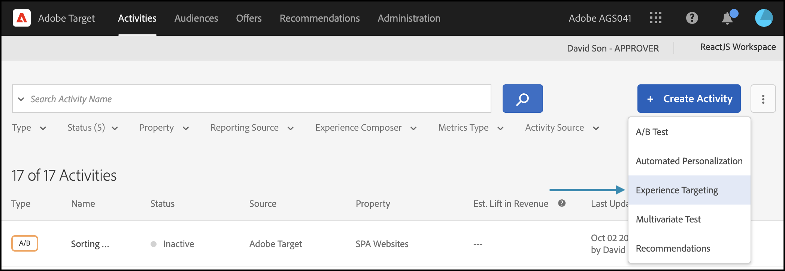
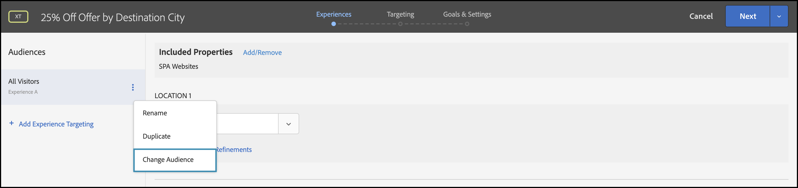

# 提供個人化

## 步驟摘要

1. 為您的組織啟用[!UICONTROL on-device decisioning]
1. 建立[!UICONTROL Experience Targeting] (XT)活動
1. 定義每個對象的個人化體驗
1. 驗證每個對象的個人化體驗
1. 設定報告
1. 新增追蹤KPI的量度
1. 在您的應用程式中實作個人化優惠
1. 實作程式碼以追蹤轉換事件
1. 啟用您的[!UICONTROL Experience Targeting] (XT)個人化活動

假設您是一家旅遊公司。 您想要提供某些旅行套餐25%的個人化優惠。 為了讓優惠方案與您的使用者產生共鳴，您決定顯示目的地城市的地標。 您也想要確保個人化優惠的傳送會在幾乎零延遲的情況下執行，以免對使用者體驗造成負面影響，並扭曲結果。

## 1.為您的組織啟用[!UICONTROL on-device decisioning]

1. 啟用裝置上決策可確保在幾乎零延遲的情況下執行A/B活動。 若要啟用此功能，請瀏覽至[!DNL Adobe Target]中的&#x200B;**[!UICONTROL Administration]** > **[!UICONTROL Implementation]** > **[!UICONTROL Account details]**，並啟用&#x200B;**[!UICONTROL On-Device Decisioning]**&#x200B;切換按鈕。

   

   >[!NOTE]
   >
   >您必須擁有管理員或核准者[使用者角色](https://experienceleague.adobe.com/docs/target/using/administer/manage-users/user-management.html)，才能啟用或停用[!UICONTROL On-Device Decisioning]切換功能。

   啟用&#x200B;**[!UICONTROL On-Device Decisioning]**&#x200B;切換後，[!DNL Adobe Target]會開始為您的使用者端產生&#x200B;*規則成品*。

## 2.建立[!UICONTROL Experience Targeting] (XT)活動

1. 在[!DNL Adobe Target]中，導覽至&#x200B;**[!UICONTROL Activities]**&#x200B;頁面，然後選取&#x200B;**[!UICONTROL Create Activity]** > **[!UICONTROL Experience Targeting]**。

   

1. 在&#x200B;**[!UICONTROL Create Experience Targeting Activity]**&#x200B;強制回應視窗中，保留預設的&#x200B;**[!UICONTROL Web]**&#x200B;選項為已選取(1)、選取&#x200B;**[!UICONTROL Form]**&#x200B;作為您的體驗撰寫器(2)、選取工作區和屬性(3)，然後按一下&#x200B;**[!UICONTROL Next]** (4)。

   

## 3.定義每個對象的個人化體驗

1. 在活動建立的&#x200B;**[!UICONTROL Experiences]**&#x200B;步驟中，按一下「**[!UICONTROL Change Audience]**」以建立想前往加州舊金山的訪客對象。

   

1. 在&#x200B;**[!UICONTROL Create Audience]**&#x200B;模式中，定義`destinationCity = San Francisco`的自訂規則。 這會定義想前往舊金山的使用者群組。

   

1. 仍然在&#x200B;**[!UICONTROL Experiences]**&#x200B;步驟中，輸入您的應用程式中要呈現有關Golden Gate Bridge之特殊優惠方案的位置(1)名稱，但僅限於前往舊金山的訪客。 在此範例中，首頁是為HTML選件(2)選取的位置，此位置已在&#x200B;**[!UICONTROL Content]**&#x200B;區域中定義。

   

1. 按一下&#x200B;**[!UICONTROL Add Experience Targeting]**&#x200B;以新增其他目標對象。 這次，藉由定義`destinationCity = New York`的對象規則，將目標定位為想要前往紐約的對象。 定義應用程式內您要呈現與帝國大廈相關之特殊優惠的位置。 在此顯示的範例中，`homepage`是為HTML選件(2)選取的位置，其定義於&#x200B;**[!UICONTROL Content]**&#x200B;區域。

   

## 4.驗證每個對象的個人化體驗

在&#x200B;**[!UICONTROL Targeting]**&#x200B;步驟中，確認您已設定每個對象所需的個人化體驗。


## 5.設定報告

在&#x200B;**[!UICONTROL Goals & Settings]**&#x200B;步驟中，選擇&#x200B;**[!UICONTROL Adobe Target]**&#x200B;作為&#x200B;**[!UICONTROL Reporting Source]**，以便在[!DNL Adobe Target] UI中檢視活動結果，或選擇&#x200B;**[!UICONTROL Adobe Analytics]**，以便在Adobe Analytics UI中檢視這些結果。


## 6.新增追蹤KPI的量度

選擇&#x200B;**[!UICONTROL Goal Metric]**&#x200B;以測量活動的成功。 在此範例中，成功的轉換取決於使用者是否點按個人化目的地選件。

## 7.在應用程式中實作您的個人化優惠

>[!BEGINTABS]

>[!TAB Node.js]

```js {line-numbers="true"}
const TargetClient = require("@adobe/target-nodejs-sdk");

const CONFIG = {
  client: "acmeclient",
  organizationId: "1234567890@AdobeOrg"
};

const targetClient = TargetClient.create(CONFIG);

targetClient.getOffers({
  request: {      
    execute: {
      pageLoad: {
        parameters: {
          destinationCity: "San Francisco"
        }
      }
    }       
  }
})
.then(console.log)
.catch(console.error);
```

>[!TAB Java]

```java {line-numbers="true"}
ClientConfig config = ClientConfig.builder()
  .client("acmeclient")
  .organizationId("1234567890@AdobeOrg")
  .build();
TargetClient targetClient = TargetClient.create(config);

Context context = new Context().channel(ChannelType.WEB);

ExecuteRequest executeRequest = new ExecuteRequest();

RequestDetails pageLoad = new RequestDetails();
pageLoad.setParameters(
    new HashMap<String, String>() {
      {
        put("destinationCity", "San Francisco");
      }
    });

executeRequest.setPageLoad(pageLoad);

TargetDeliveryRequest request = TargetDeliveryRequest.builder()
  .context(context)
  .execute(executeRequest)
  .build();

TargetDeliveryResponse offers = targetClient.getOffers(request);
```

>[!ENDTABS]

## 8.實作程式碼以追蹤轉換事件

>[!BEGINTABS]

>[!TAB Node.js]

```js {line-numbers="true"}
//... Code removed for brevity

//When a conversion happens
TargetClient.sendNotifications({
    targetCookie,
    "request" : {
      "notifications" : [
        {
          type: "click",
          timestamp : Date.now(),
          id: "conversion",
          mbox : {
            name : "destinationOffer"
          }
        }
      ]
    }
})
```

>[!TAB Java]

```java {line-numbers="true"
ClientConfig config = ClientConfig.builder()
  .client("acmeclient")
  .organizationId("1234567890@AdobeOrg")
  .build();
TargetClient targetClient = TargetClient.create(config);

Context context = new Context().channel(ChannelType.WEB);

ExecuteRequest executeRequest = new ExecuteRequest();

RequestDetails pageLoad = new RequestDetails();
pageLoad.setParameters(
    new HashMap<String, String>() {
      {
        put("destinationCity", "San Francisco");
      }
    });

executeRequest.setPageLoad(pageLoad);
NotificationDeliveryService notificationDeliveryService = new NotificationDeliveryService();

Notification notification = new Notification();
notification.setId("conversion");
notification.setImpressionId(UUID.randomUUID().toString());
notification.setType(MetricType.CLICK);
notification.setTimestamp(System.currentTimeMillis());
notification.setTokens(
    Collections.singletonList(
        "IbG2Jz2xmHaqX7Ml/YRxRGqipfsIHvVzTQxHolz2IpSCnQ9Y9OaLL2gsdrWQTvE54PwSz67rmXWmSnkXpSSS2Q=="));

TargetDeliveryRequest targetDeliveryRequest =
    TargetDeliveryRequest.builder()
        .context(context)
        .execute(executeRequest)
        .notifications(Collections.singletonList(notification))
        .build();

TargetDeliveryResponse offers = targetClient.getOffers(request);
notificationDeliveryService.sendNotification(request);
```

>[!ENDTABS]

## 9.啟用您的體驗鎖定目標(XT)活動


