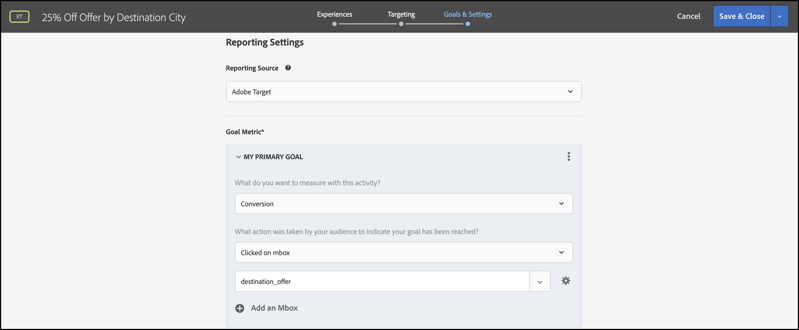

# 提供個人化

## 步驟摘要

1. 啟用 [!UICONTROL 裝置上決策] 適用於您的組織
1. 建立 [!UICONTROL 體驗鎖定] (XT)活動
1. 定義每個對象的個人化體驗
1. 驗證每個對象的個人化體驗
1. 設定報告
1. 新增追蹤KPI的量度
1. 在您的應用程式中實作個人化優惠
1. 實作程式碼以追蹤轉換事件
1. 啟用您的 [!UICONTROL 體驗鎖定] (XT)個人化活動

假設您是一家旅遊公司。 您想要提供某些旅行套餐25%的個人化優惠。 為了讓優惠方案與您的使用者產生共鳴，您決定顯示目的地城市的地標。 您也想要確保個人化優惠的傳送會在幾乎零延遲的情況下執行，以免對使用者體驗造成負面影響，並扭曲結果。

## 1.啟用 [!UICONTROL 裝置上決策] 適用於您的組織

1. 啟用裝置上決策可確保在幾乎零延遲的情況下執行A/B活動。 若要啟用此功能，請瀏覽至 **[!UICONTROL 管理]** > **[!UICONTROL 實施]** > **[!UICONTROL 帳戶詳細資料]** 在 [!DNL Adobe Target]，並啟用 **[!UICONTROL 裝置上決策]** 切換。

   

   >[!NOTE]
   >
   >您必須擁有管理員或核准者 [使用者角色](https://experienceleague.adobe.com/docs/target/using/administer/manage-users/user-management.html) 啟用或停用 [!UICONTROL 裝置上決策] 切換。

   啟用 **[!UICONTROL 裝置上決策]** 切換， [!DNL Adobe Target] 開始產生 *規則人工因素* 適用於您的使用者端。

## 2.建立 [!UICONTROL 體驗鎖定] (XT)活動

1. 在 [!DNL Adobe Target]，導覽至 **[!UICONTROL 活動]** 頁面，然後選取 **[!UICONTROL 建立活動]** > **[!UICONTROL 體驗鎖定]**.

   

1. 在 **[!UICONTROL 建立體驗鎖定目標活動]** 強制回應視窗，保留預設值 **[!UICONTROL Web]** 已選取選項(1)，選取 **[!UICONTROL 表單]** 以體驗撰寫器(2)的身分，選取工作區和屬性(3)，然後按一下 **[!UICONTROL 下一個]** (4)。

   

## 3.定義每個對象的個人化體驗

1. 在 **[!UICONTROL 體驗]** 活動建立的步驟，按一下 **[!UICONTROL 變更對象]** 建立想前往加州舊金山的訪客受眾。

   

1. 在 **[!UICONTROL 建立對象]** 模型，定義自訂規則，其中 `destinationCity = San Francisco`. 這會定義想前往舊金山的使用者群組。

   

1. 仍在 **[!UICONTROL 體驗]** 步驟，在您的應用程式中輸入位置名稱(1)，您要針對希望呈現有關Golden Gate Bridge的特殊優惠方案，但僅限於前往舊金山的使用者。 在此處的範例中， homepage是為HTML選件(2)選取的位置，其定義位於 **[!UICONTROL 內容]** 區域。

   

1. 按一下「 」以新增另一個目標對象 **[!UICONTROL 新增體驗鎖定目標]**. 這次，藉由定義對象規則來鎖定想要前往紐約的對象，其中 `destinationCity = New York`. 定義應用程式內您要呈現與帝國大廈相關之特殊優惠的位置。 在此處的範例中， `homepage` 是為HTML選件(2)選取的位置，其定義於 **[!UICONTROL 內容]** 區域。

   

## 4.驗證每個對象的個人化體驗

在 **[!UICONTROL 目標定位]** 步驟，確認您已設定每個對象所需的個人化體驗。


## 5.設定報告

在 **[!UICONTROL 目標與設定]** 步驟，選擇 **[!UICONTROL Adobe Target]** 作為 **[!UICONTROL 報表來源]** 若要在中檢視活動結果 [!DNL Adobe Target] UI，或選擇 **[!UICONTROL Adobe Analytics]** 以在Adobe Analytics UI中檢視。



## 6.新增追蹤KPI的量度

選擇 **[!UICONTROL 目標量度]** 以測量活動的成功。 在此範例中，成功的轉換取決於使用者是否點按個人化目的地選件。

## 7.在應用程式中實作您的個人化優惠

>[!BEGINTABS]

>[!TAB Node.js]

```js {line-numbers="true"}
const TargetClient = require("@adobe/target-nodejs-sdk");

const CONFIG = {
  client: "acmeclient",
  organizationId: "1234567890@AdobeOrg"
};

const targetClient = TargetClient.create(CONFIG);

targetClient.getOffers({
  request: {      
    execute: {
      pageLoad: {
        parameters: {
          destinationCity: "San Francisco"
        }
      }
    }       
  }
})
.then(console.log)
.catch(console.error);
```

>[!TAB Java]

```java {line-numbers="true"}
ClientConfig config = ClientConfig.builder()
  .client("acmeclient")
  .organizationId("1234567890@AdobeOrg")
  .build();
TargetClient targetClient = TargetClient.create(config);

Context context = new Context().channel(ChannelType.WEB);

ExecuteRequest executeRequest = new ExecuteRequest();

RequestDetails pageLoad = new RequestDetails();
pageLoad.setParameters(
    new HashMap<String, String>() {
      {
        put("destinationCity", "San Francisco");
      }
    });

executeRequest.setPageLoad(pageLoad);

TargetDeliveryRequest request = TargetDeliveryRequest.builder()
  .context(context)
  .execute(executeRequest)
  .build();

TargetDeliveryResponse offers = targetClient.getOffers(request);
```

>[!ENDTABS]

## 8.實作程式碼以追蹤轉換事件

>[!BEGINTABS]

>[!TAB Node.js]

```js {line-numbers="true"}
//... Code removed for brevity

//When a conversion happens
TargetClient.sendNotifications({
    targetCookie,
    "request" : {
      "notifications" : [
        {
          type: "click",
          timestamp : Date.now(),
          id: "conversion",
          mbox : {
            name : "destinationOffer"
          }
        }
      ]
    }
})
```

>[!TAB Java]

```java {line-numbers="true"
ClientConfig config = ClientConfig.builder()
  .client("acmeclient")
  .organizationId("1234567890@AdobeOrg")
  .build();
TargetClient targetClient = TargetClient.create(config);

Context context = new Context().channel(ChannelType.WEB);

ExecuteRequest executeRequest = new ExecuteRequest();

RequestDetails pageLoad = new RequestDetails();
pageLoad.setParameters(
    new HashMap<String, String>() {
      {
        put("destinationCity", "San Francisco");
      }
    });

executeRequest.setPageLoad(pageLoad);
NotificationDeliveryService notificationDeliveryService = new NotificationDeliveryService();

Notification notification = new Notification();
notification.setId("conversion");
notification.setImpressionId(UUID.randomUUID().toString());
notification.setType(MetricType.CLICK);
notification.setTimestamp(System.currentTimeMillis());
notification.setTokens(
    Collections.singletonList(
        "IbG2Jz2xmHaqX7Ml/YRxRGqipfsIHvVzTQxHolz2IpSCnQ9Y9OaLL2gsdrWQTvE54PwSz67rmXWmSnkXpSSS2Q=="));

TargetDeliveryRequest targetDeliveryRequest =
    TargetDeliveryRequest.builder()
        .context(context)
        .execute(executeRequest)
        .notifications(Collections.singletonList(notification))
        .build();

TargetDeliveryResponse offers = targetClient.getOffers(request);
notificationDeliveryService.sendNotification(request);
```

>[!ENDTABS]

## 9.啟用您的體驗鎖定目標(XT)活動


