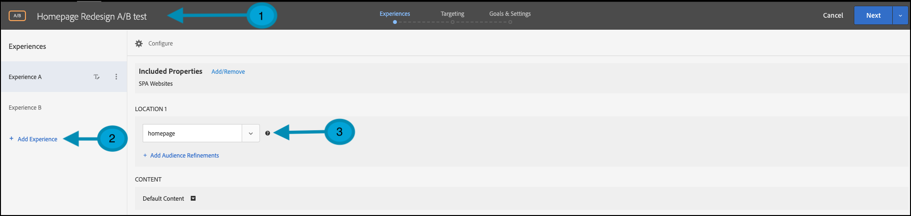
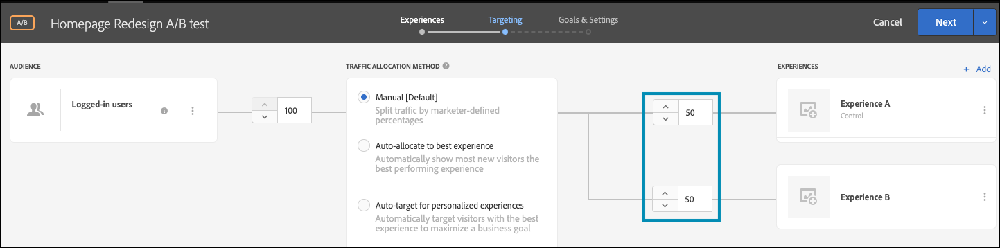

# 使用功能標幟執行A/B測試

## 步驟摘要

1. 為您的組織啟用[!UICONTROL on-device decisioning]
1. 建立[!UICONTROL A/B Test]活動
1. 定義您的A和B
1. 新增對象
1. 設定流量分配
1. 將流量分佈設為變數
1. 設定報告
1. 新增追蹤KPI的量度
1. 實作程式碼以使用功能標幟執行A/B測試
1. 使用功能標幟啟用您的A/B測試

>[!NOTE]
>
>假設您想要判斷使用者能否順利接受您首頁的秋季主題重新設計。 您決定在[!DNL Adobe Target]中執行A/B實驗以測試它。 您也想要確保提供最佳效能的實驗，以免負面或緩慢的使用者體驗扭曲結果。

## 1.為您的組織啟用[!UICONTROL on-device decisioning]

啟用裝置上決策可確保在幾乎零延遲的情況下執行A/B活動。 若要啟用此功能，請瀏覽至[!DNL Adobe Target]中的&#x200B;**[!UICONTROL Administration]** > **[!UICONTROL Implementation]** > **[!UICONTROL Account details]**，並啟用&#x200B;**[!UICONTROL On-Device Decisioning]**&#x200B;切換按鈕。

&lt;！ — 插入image-odd4.png —>


>[!NOTE]
>
>您必須擁有管理員或核准者[使用者角色](https://experienceleague.adobe.com/docs/target/using/administer/manage-users/user-management.html)，才能啟用或停用「裝置上決策」切換。

啟用&#x200B;**[!UICONTROL On-Device Decisioning]**&#x200B;切換後，[!DNL Adobe Target]會開始為您的使用者端產生規則成品。

## 2.建立[!UICONTROL A/B Test]活動

在[!DNL Adobe Target]中，導覽至&#x200B;**[!UICONTROL Activities]**&#x200B;頁面，然後選取&#x200B;**[!UICONTROL Create Activity]** > **[!UICONTROL A/B test]**。


在&#x200B;**[!UICONTROL Create A/B Test Activity]**&#x200B;強制回應視窗中，保留預設的&#x200B;**[!UICONTROL Web]**&#x200B;選項為已選取(1)，選取&#x200B;**[!UICONTROL Form]**&#x200B;作為您的體驗撰寫器(2)，選取沒有&#x200B;**[!UICONTROL Property Restrictions]**&#x200B;的&#x200B;**[!UICONTROL Default Workspace]** (3)，然後按一下&#x200B;**[!UICONTROL Next]** (4)。


## 3.定義您的A和B

1. 在活動建立的&#x200B;**[!UICONTROL Experiences]**&#x200B;步驟中，提供活動的名稱(1)並新增第二個體驗，即體驗B，方法是按一下&#x200B;**[!UICONTROL Add Experience]** (2)按鈕。 輸入應用程式中要執行A/B測試之位置(3)的名稱。 在下列範例中，「首頁」是為體驗A定義的位置。（它也是為體驗B定義的位置。）

   體驗A會定義控制項，這是目前的首頁設計。

   

   體驗B會定義挑戰者，代表重新設計的首頁。 按一下以變更預設內容(1)。

   

1. 在體驗B中，按一下以選取&#x200B;**[!UICONTROL Create JSON Offer]**，將內容從&#x200B;**[!UICONTROL Default Content]**&#x200B;變更為重新設計的內容，如下所示(1)。

   

1. 使用當作標幟的屬性來定義JSON，讓您的商業邏輯呈現新重新設計的首頁，而不是生產環境中的目前首頁。


   >[!NOTE]
   >
   >當[!DNL Adobe Target]儲存使用者以檢視體驗B （重新設計的首頁）時，將會傳回具有範例中定義的屬性的JSON。 在您的程式碼中，您將需要檢查屬性值，以決定是否執行商業邏輯以轉譯重新設計的首頁。 您可以定義此JSON回應中的名稱、值和屬性數量。

   

## 4.新增對象

假設您想先對您的忠實客戶測試重新設計，可以根據他們是否已登入來識別這些客戶。

1. 在&#x200B;**[!UICONTROL Targeting]**&#x200B;步驟中，按一下以取代&#x200B;**[!UICONTROL All Visitors]**&#x200B;對象，如所示。

   

1. 在&#x200B;**[!UICONTROL Create Audience]**&#x200B;模式中，定義`logged-in = true`的自訂規則。 這會定義已登入的使用者群組。 在您的活動中使用這個對象。

   

## 5.設定流量分配

定義您要用來測試新首頁重新設計的登入使用者百分比。 換言之，您要將這個測試轉出到您的使用者中哪個百分比？ 在此範例中，若要將此測試部署給所有登入的使用者，請將流量分配維持在100%。


## 6.將流量分佈設為變數

定義您的登入使用者中，可看見首頁目前設計或全新重新設計的百分比。 在此範例中，流量分配在體驗A和B之間維持50/50的分割比例。



## 7.設定報告

在&#x200B;**[!UICONTROL Goals & Settings]**&#x200B;步驟中，選擇&#x200B;**[!UICONTROL Adobe Target]**&#x200B;作為&#x200B;**[!UICONTROL Reporting Source]**，以便在[!DNL Adobe Target] UI中檢視活動結果，或選擇&#x200B;**[!UICONTROL Adobe Analytics]**，以便在Adobe Analytics UI中檢視這些結果。


## 8.新增追蹤KPI的量度

選擇&#x200B;**[!UICONTROL Goal Metric]**&#x200B;以測量A/B測試。 在此範例中，成功的轉換是根據使用者是否到達頁面底部，表示參與。 因此，會根據使用者是否檢視名為bottom-of-the-page的位置來判斷&#x200B;**[!UICONTROL Conversion]**。

## 9.匯入程式碼，以在您的應用程式中使用功能標幟執行A/B測試

>[!BEGINTABS]

>[!TAB Node.js]

```js {line-numbers="true"}
const TargetClient = require("@adobe/target-nodejs-sdk");
const options = {
  client: "testClient",
  organizationId: "ABCDEF012345677890ABCDEF0@AdobeOrg",
  decisioningMethod: "on-device",
  events: {
    clientReady: targetClientReady
  }
};
const targetClient = TargetClient.create(options);

function targetClientReady() {
  return targetClient.getAttributes(["homepage"]).then(function(attributes) {
    const flag = attributes.getValue("homepage", "feature-flag");
    // ...
  });
}
```

>[!TAB Java]

```java {line-numbers="true"}
import com.adobe.target.edge.client.ClientConfig;
import com.adobe.target.edge.client.TargetClient;
import com.adobe.target.delivery.v1.model.ChannelType;
import com.adobe.target.delivery.v1.model.Context;
import com.adobe.target.delivery.v1.model.ExecuteRequest;
import com.adobe.target.delivery.v1.model.MboxRequest;
import com.adobe.target.edge.client.entities.TargetDeliveryRequest;
import com.adobe.target.edge.client.model.TargetDeliveryResponse;

ClientConfig config = ClientConfig.builder()
    .client("testClient")
    .organizationId("ABCDEF012345677890ABCDEF0@AdobeOrg")
    .build();
TargetClient targetClient = TargetClient.create(config);
MboxRequest mbox = new MboxRequest().name("homepage").index(0);
TargetDeliveryRequest request = TargetDeliveryRequest.builder()
    .context(new Context().channel(ChannelType.WEB))
    .execute(new ExecuteRequest().mboxes(Arrays.asList(mbox)))
    .build();
Attributes attributes = targetClient.getAttributes(request, "homepage");
String flag = attributes.getString("homepage", "feature-flag");
```

>[!ENDTABS]

## 10.使用功能標幟啟用您的A/B測試


