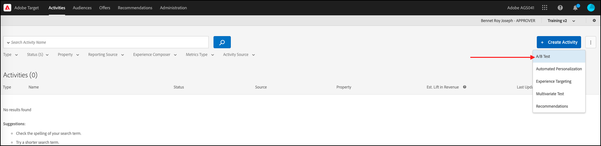
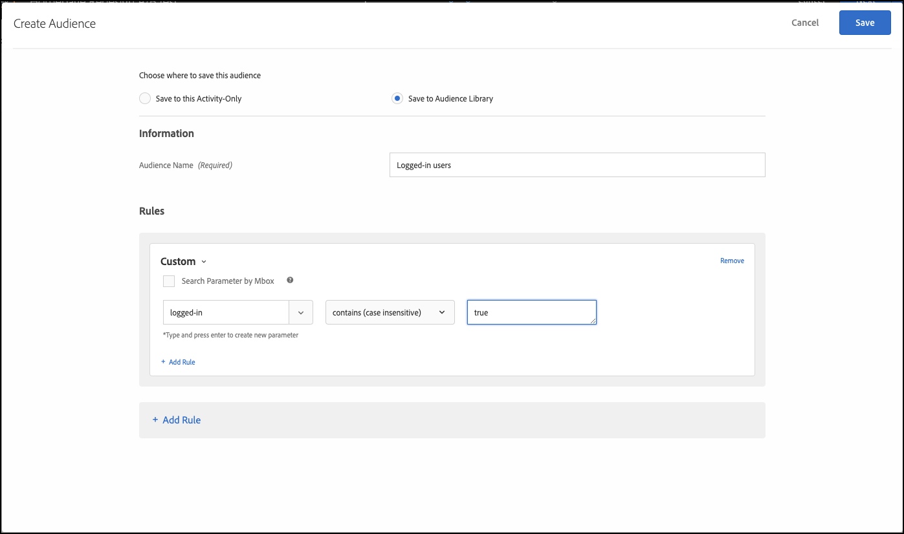

# 使用功能標幟執行A/B測試

## 步驟摘要

1. 啟用 [!UICONTROL 裝置上決策] 適用於您的組織
1. 建立 [!UICONTROL A/B測試] 活動
1. 定義您的A和B
1. 新增對象
1. 設定流量分配
1. 將流量分佈設為變數
1. 設定報告
1. 新增追蹤KPI的量度
1. 實作程式碼以使用功能標幟執行A/B測試
1. 使用功能標幟啟用您的A/B測試

>[!NOTE]
>
>假設您想要判斷使用者能否順利接受您首頁的秋季主題重新設計。 您決定在中執行A/B實驗來測試它 [!DNL Adobe Target]. 您也想要確保提供最佳效能的實驗，以免負面或緩慢的使用者體驗扭曲結果。

## 1.啟用 [!UICONTROL 裝置上決策] 適用於您的組織

啟用裝置上決策可確保在幾乎零延遲的情況下執行A/B活動。 若要啟用此功能，請瀏覽至 **[!UICONTROL 管理]** > **[!UICONTROL 實施]** > **[!UICONTROL 帳戶詳細資料]** 在 [!DNL Adobe Target]，並啟用 **[!UICONTROL 裝置上決策]** 切換。

&lt;! — 插入image-odd4.png —>


>[!NOTE]
>
>您必須擁有管理員或核准者 [使用者角色](https://experienceleague.adobe.com/docs/target/using/administer/manage-users/user-management.html) 以啟用或停用「裝置上決策」切換按鈕。

啟用 **[!UICONTROL 裝置上決策]** 切換， [!DNL Adobe Target] 開始為使用者端產生規則成品。

## 2.建立 [!UICONTROL A/B測試] 活動

在 [!DNL Adobe Target]，導覽至 **[!UICONTROL 活動]** 頁面，然後選取 **[!UICONTROL 建立活動]** > **[!UICONTROL A/B測試]**.



在 **[!UICONTROL 建立A/B測試活動]** 強制回應視窗，保留預設值 **[!UICONTROL Web]** 已選取選項(1)，選取 **[!UICONTROL 表單]** 由於您的體驗撰寫器(2)，請選取「 」 **[!UICONTROL 預設工作區]** 不含 **[!UICONTROL 屬性限制]** (3)，然後按一下 **[!UICONTROL 下一個]** (4)。


## 3.定義您的A和B

1. 在 **[!UICONTROL 體驗]** 活動建立步驟，提供活動的名稱(1)並新增第二個體驗，體驗B，方法是按一下 **[!UICONTROL 新增體驗]** (2)按鈕。 輸入應用程式中要執行A/B測試之位置(3)的名稱。 在下列範例中，「首頁」是為體驗A定義的位置。（它也是為體驗B定義的位置。）

   體驗A會定義控制項，這是目前的首頁設計。

   

   體驗B會定義挑戰者，代表重新設計的首頁。 按一下以變更預設內容(1)。

   

1. 在體驗B中，按一下以變更內容，從 **[!UICONTROL 預設內容]** 至重新設計的內容，方法是選取 **[!UICONTROL 建立JSON選件]** 如下所示(1)。

   

1. 使用當作標幟的屬性來定義JSON，讓您的商業邏輯呈現新重新設計的首頁，而不是生產環境中的目前首頁。


   >[!NOTE]
   >
   >時間 [!DNL Adobe Target] 儲存使用者以檢視體驗B （重新設計的首頁），將會傳回具有範例中定義屬性的JSON。 在您的程式碼中，您將需要檢查屬性值，以決定是否執行商業邏輯以轉譯重新設計的首頁。 您可以定義此JSON回應中的名稱、值和屬性數量。

   

## 4.新增對象

假設您想先對您的忠實客戶測試重新設計，可以根據他們是否已登入來識別這些客戶。

1. 在 **[!UICONTROL 目標定位]** 步驟，按一下以 **[!UICONTROL 所有訪客]** 對象，如下所示。

   

1. 在 **[!UICONTROL 建立對象]** 模型，定義自訂規則，其中 `logged-in = true`. 這會定義已登入的使用者群組。 在您的活動中使用這個對象。

   

## 5.設定流量分配

定義您要用來測試新首頁重新設計的登入使用者百分比。 換言之，您要將這個測試轉出到您的使用者中哪個百分比？ 在此範例中，若要將此測試部署給所有登入的使用者，請將流量分配維持在100%。


## 6.將流量分佈設為變數

定義您的登入使用者中，可看見首頁目前設計或全新重新設計的百分比。 在此範例中，流量分配在體驗A和B之間維持50/50的分割比例。


## 7.設定報告

在 **[!UICONTROL 目標與設定]** 步驟，選擇 **[!UICONTROL Adobe Target]** 作為 **[!UICONTROL 報表來源]** 若要在中檢視活動結果 [!DNL Adobe Target] UI，或選擇 **[!UICONTROL Adobe Analytics]** 以在Adobe Analytics UI中檢視。


## 8.新增追蹤KPI的量度

選擇 **[!UICONTROL 目標量度]** 測量A/B測試。 在此範例中，成功的轉換是根據使用者是否到達頁面底部，表示參與。 因此， **[!UICONTROL 轉換]** 是根據使用者是否檢視名為bottom-of-the-page的位置所決定。

## 9.匯入程式碼，以在您的應用程式中使用功能標幟執行A/B測試

>[!BEGINTABS]

>[!TAB Node.js]

```js {line-numbers="true"}
const TargetClient = require("@adobe/target-nodejs-sdk");
const options = {
  client: "testClient",
  organizationId: "ABCDEF012345677890ABCDEF0@AdobeOrg",
  decisioningMethod: "on-device",
  events: {
    clientReady: targetClientReady
  }
};
const targetClient = TargetClient.create(options);

function targetClientReady() {
  return targetClient.getAttributes(["homepage"]).then(function(attributes) {
    const flag = attributes.getValue("homepage", "feature-flag");
    // ...
  });
}
```

>[!TAB Java]

```java {line-numbers="true"}
import com.adobe.target.edge.client.ClientConfig;
import com.adobe.target.edge.client.TargetClient;
import com.adobe.target.delivery.v1.model.ChannelType;
import com.adobe.target.delivery.v1.model.Context;
import com.adobe.target.delivery.v1.model.ExecuteRequest;
import com.adobe.target.delivery.v1.model.MboxRequest;
import com.adobe.target.edge.client.entities.TargetDeliveryRequest;
import com.adobe.target.edge.client.model.TargetDeliveryResponse;

ClientConfig config = ClientConfig.builder()
    .client("testClient")
    .organizationId("ABCDEF012345677890ABCDEF0@AdobeOrg")
    .build();
TargetClient targetClient = TargetClient.create(config);
MboxRequest mbox = new MboxRequest().name("homepage").index(0);
TargetDeliveryRequest request = TargetDeliveryRequest.builder()
    .context(new Context().channel(ChannelType.WEB))
    .execute(new ExecuteRequest().mboxes(Arrays.asList(mbox)))
    .build();
Attributes attributes = targetClient.getAttributes(request, "homepage");
String flag = attributes.getString("homepage", "feature-flag");
```

>[!ENDTABS]

## 10.使用功能標幟啟用您的A/B測試


