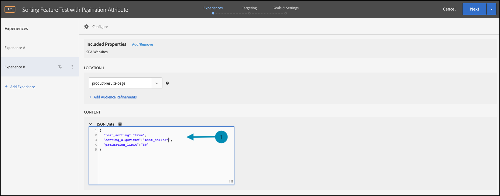

# 使用屬性執行功能測試

## 步驟摘要

1. 啟用 [!UICONTROL 裝置上決策] 適用於您的組織
1. 建立 [!UICONTROL A/B測試] 活動
1. 定義您的A和B
1. 新增對象
1. 設定流量分配
1. 將流量分佈設為變數
1. 設定報告
1. 新增追蹤KPI的量度
1. 實作程式碼以使用屬性執行功能測試
1. 實作程式碼以追蹤轉換事件
1. 使用屬性啟用功能測試

>[!NOTE]
>
>假設您是一間零售電子商務公司。 當客戶瀏覽及排序您的產品目錄時，您想要提高轉換率。 您有假設認為，某些排序演演算法和分頁策略會產生比其他演演算法更好的結果。 為了測試此理論，您決定執行功能測試，該測試涉及使用一般使用者的不同排序選項來重新設計排序Widget。 您想要確保此功能測試會在幾乎零延遲的情況下執行，以免對使用者體驗造成負面影響，並扭曲結果。

## 1.啟用 [!UICONTROL 裝置上決策] 適用於您的組織

啟用裝置上決策可確保在幾乎零延遲的情況下執行A/B活動。 若要啟用此功能，請瀏覽至 **[!UICONTROL 管理]** > **[!UICONTROL 實施]** > **[!UICONTROL 帳戶詳細資料]** 在 [!DNL Adobe Target]，並啟用 **[!UICONTROL 裝置上決策]** 切換。


>[!NOTE]
>
>您必須擁有管理員或核准者 [使用者角色](https://experienceleague.adobe.com/docs/target/using/administer/manage-users/user-management.html) 啟用或停用 **[!UICONTROL 裝置上決策]** 切換。

啟用 **[!UICONTROL 裝置上決策]** 切換， [!DNL Adobe Target] 開始產生 *規則人工因素* 適用於您的使用者端。

## 2.建立 [!UICONTROL A/B測試] 活動

1. 在 [!DNL Adobe Target]，導覽至 **[!UICONTROL 活動]** 頁面，然後選取 **[!UICONTROL 建立活動]** > **[!UICONTROL A/B測試]**.

   

1. 在 **[!UICONTROL 建立A/B測試活動]** 強制回應視窗，保留預設值 **[!UICONTROL Web]** 已選取選項(1)，選取 **[!UICONTROL 表單]** 由於您的體驗撰寫器(2)，請選取「 」 **[!UICONTROL 預設工作區]** 替換為 **[!UICONTROL 無屬性限制]** (3)，然後按一下 **[!UICONTROL 下一個]** (4)。

   

## 3.定義您的A和B

1. 在 **[!UICONTROL 體驗]** 活動建立步驟，提供活動的名稱(1)並新增第二個體驗，體驗B，方法是按一下 **[!UICONTROL 新增體驗]** (2)按鈕。 輸入應用程式中要使用屬性執行特徵測試的位置(3)名稱。 在下列範例中， `product-results-page` 是為體驗A定義的位置。（也是為體驗B定義的位置。）

   

   **[!UICONTROL 體驗A]** 將包含JSON，其代表您的商業邏輯執行下列動作：

   * 透過啟動排序演演算法功能 `test_sorting` 功能標幟
   * 執行中定義的建議排序演演算法 `sorting_algorithm _**_attribute`
   * 依中定義的分頁策略所定義，每頁傳回50種產品。 `pagination_limit`

1. 在體驗A中，按一下以變更內容，從 **[!UICONTROL 預設內容]** 至JSON，方法是選取 **[!UICONTROL 建立JSON選件]** 如下所示(1)。

   

1. 使用定義JSON `test_sorting`， `sorting_algorithm`、和 `pagination_limit` 會用來起始建議排序演演算法的標幟和屬性，分頁限製為50個產品。

   >[!NOTE]
   >
   >時間 [!DNL Adobe Target] 將使用者儲存起來，以便檢視體驗A，系統將會傳回範例中具有已定義屬性的JSON。 在您的程式碼中，您需要檢查功能標幟的值 `test_sorting` 以檢視排序功能是否應該開啟。 若是如此，您會使用 `sorting_algorithm` 屬性，在產品清單檢視中顯示建議的產品。 為您的應用程式顯示的產品限制將為50，因為這是 `pagination_limit` 屬性。

   

   **[!UICONTROL 體驗B]** 將定義代表您商業邏輯的JSON以執行下列動作：

   * 透過test_sorting功能旗標啟動排序演演算法功能
   * 執行 `best_sellers` 排序演演算法定義於 `sorting_algorithm _**_attribute`
   * 依中定義的分頁策略所定義，每頁傳回50種產品。 `pagination_limit`

   >[!NOTE]
   >
   >時間 [!DNL Adobe Target] 儲存使用者以檢視體驗B，將會傳回範例中具有已定義屬性的JSON。 在您的程式碼中，您需要檢查功能標幟的值 `test_sorting` 以檢視排序功能是否應該開啟。 若是如此，您將使用 `best_sellers` 的值 `sorting_algorithm` 屬性，在產品清單檢視中顯示最暢銷的產品。 為您的應用程式顯示的產品限制將為50，因為這是 `pagination_limit` 屬性。

   

## 4.新增對象

在 **[!UICONTROL 目標定位]** 步驟，保留 **[!UICONTROL 所有訪客]** 對象。 這可讓您瞭解排序功能的影響，以及哪個演演算法和專案數量對結果影響最大。


## 5.設定流量分配

定義訪客百分比，以用來測試排序演演算法和分頁策略。 換言之，您要將這個測試轉出到您的使用者中哪個百分比？ 在此範例中，若要將此測試部署給所有登入的使用者，請將流量分配維持在100%。


## 6.將流量分佈設為變數

定義會看見建議與最暢銷商品排序演演算法的訪客百分比，限製為每頁50項產品。 在此範例中，流量分配在體驗A和B之間維持50/50的分割比例。


## 7.設定報告

在 **[!UICONTROL 目標與設定]** 步驟，選擇 **[!UICONTROL Adobe Target]** 作為 **[!UICONTROL 報表來源]** 若要在中檢視您的A/B測試結果 [!DNL Adobe Target] UI，或選擇 **[!UICONTROL Adobe Analytics]** 以在Adobe Analytics UI中檢視。


## 8.新增追蹤KPI的量度

選擇 **[!UICONTROL 目標量度]** 以量測具有屬性的特徵測試。 在此範例中，成功取決於使用者是否購買產品，取決於他們看到的排序演演算法和分頁策略。

## 9.使用屬性實施功能測試至您的應用程式

>[!BEGINTABS]

>[!TAB Node.js]

```js {line-numbers="true"}
const TargetClient = require("@adobe/target-nodejs-sdk");
const options = {
  client: "testClient",
  organizationId: "ABCDEF012345677890ABCDEF0@AdobeOrg",
  decisioningMethod: "on-device",
  events: {
    clientReady: targetClientReady
  }
};
const targetClient = TargetClient.create(options);

function targetClientReady() {
  return targetClient.getAttributes(["product-results-page"]).then(function(attributes) {
    const test_sorting = attributes.getValue("product-results-page", "test-sorting");
    const sorting_algorithm = attributes.getValue("product-results-page", "sorting_algorithm");
    const pagination_limit = attributes.getValue("product-results-page", "pagination_limit");
  });
}
```

>[!TAB Java]

```java {line-numbers="true"}
import com.adobe.target.edge.client.ClientConfig;
import com.adobe.target.edge.client.TargetClient;
import com.adobe.target.delivery.v1.model.ChannelType;
import com.adobe.target.delivery.v1.model.Context;
import com.adobe.target.delivery.v1.model.ExecuteRequest;
import com.adobe.target.delivery.v1.model.MboxRequest;
import com.adobe.target.edge.client.entities.TargetDeliveryRequest;
import com.adobe.target.edge.client.model.TargetDeliveryResponse;

ClientConfig config = ClientConfig.builder()
    .client("testClient")
    .organizationId("ABCDEF012345677890ABCDEF0@AdobeOrg")
    .build();
TargetClient targetClient = TargetClient.create(config);
MboxRequest mbox = new MboxRequest().name("product-results-page").index(0);
TargetDeliveryRequest request = TargetDeliveryRequest.builder()
    .context(new Context().channel(ChannelType.WEB))
    .execute(new ExecuteRequest().mboxes(Arrays.asList(mbox)))
    .build();
Attributes attributes = targetClient.getAttributes(request, "product-results-page");
String testSorting = attributes.getString("product-results-page", "test-sorting");
String sortingAlgorithm = attributes.getString("product-results-page", "sorting_algorithm");
String paginationLimit = attributes.getString("product-results-page", "pagination_limit");
```

>[!ENDTABS]

## 10.實作程式碼以追蹤轉換事件

>[!BEGINTABS]

>[!TAB Node.js]

```js {line-numbers="true"}
//... Code removed for brevity

//When a conversion happens
TargetClient.sendNotifications({
    targetCookie,
    "request" : {
      "notifications" : [
        {
          type: "click",
          timestamp : Date.now(),
          id: "conversion",
          mbox : {
            name : "product-results-page"
          }
        }
      ]
    }
})
```

>[!TAB Java]

```java {line-numbers="true"}
ClientConfig config = ClientConfig.builder()
  .client("acmeclient")
  .organizationId("1234567890@AdobeOrg")
  .build();
TargetClient targetClient = TargetClient.create(config);

Context context = new Context().channel(ChannelType.WEB);

ExecuteRequest executeRequest = new ExecuteRequest();

NotificationDeliveryService notificationDeliveryService = new NotificationDeliveryService();

Notification notification = new Notification();
notification.setId("conversion");
notification.setImpressionId(UUID.randomUUID().toString());
notification.setType(MetricType.CLICK);
notification.setTimestamp(System.currentTimeMillis());
notification.setTokens(
    Collections.singletonList(
        "IbG2Jz2xmHaqX7Ml/YRxRGqipfsIHvVzTQxHolz2IpSCnQ9Y9OaLL2gsdrWQTvE54PwSz67rmXWmSnkXpSSS2Q=="));

TargetDeliveryRequest targetDeliveryRequest =
    TargetDeliveryRequest.builder()
        .context(context)
        .execute(executeRequest)
        .notifications(Collections.singletonList(notification))
        .build();

TargetDeliveryResponse offers = targetClient.getOffers(request);
notificationDeliveryService.sendNotification(request);

Attributes attributes = targetClient.getAttributes(request, "product-results-page");
String testSorting = attributes.getString("product-results-page", "test-sorting");
String sortingAlgorithm = attributes.getString("product-results-page", "sorting_algorithm");
String paginationLimit = attributes.getString("product-results-page", "pagination_limit");
```

>[!ENDTABS]

## 11.使用屬性啟用功能測試


