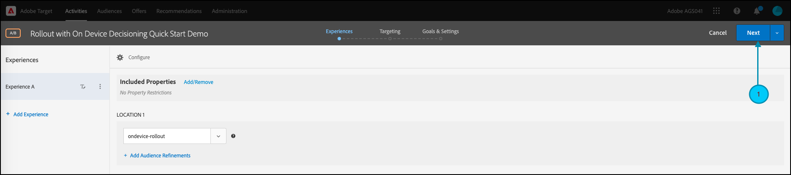

# 管理功能測試的轉出

## 步驟摘要

1. 為您的組織啟用[!UICONTROL on-device decisioning]
1. 建立[!UICONTROL A/B Test]活動
1. 定義您的功能和轉出設定
1. 在您的應用程式中實作及演算功能
1. 實施應用程式中事件的追蹤
1. 啟用您的A/B活動
1. 視需要調整轉出和流量分配

## 1.為您的組織啟用[!UICONTROL on-device decisioning]

啟用裝置上決策可確保在幾乎零延遲的情況下執行A/B活動。 若要啟用此功能，請瀏覽至[!DNL Adobe Target]中的&#x200B;**[!UICONTROL Administration]** > **[!UICONTROL Implementation]** > **[!UICONTROL Account details]**，並啟用&#x200B;**[!UICONTROL On-Device Decisioning]**&#x200B;切換按鈕。


>[!NOTE]
>
>您必須擁有管理員或核准者[使用者角色](https://experienceleague.adobe.com/docs/target/using/administer/manage-users/user-management.html)，才能啟用或停用[!UICONTROL On-Device Decisioning]切換功能。

啟用[!UICONTROL On-Device Decisioning]切換後，[!DNL Adobe Target]會開始為您的使用者端產生&#x200B;*規則成品*。

## 2.建立[!UICONTROL A/B Test]活動

1. 在[!DNL Adobe Target]中，導覽至&#x200B;**[!UICONTROL Activities]**&#x200B;頁面，然後選取&#x200B;**[!UICONTROL Create Activity]** > **[!UICONTROL A/B test]**。

   

1. 在&#x200B;**[!UICONTROL Create A/B Test Activity]**&#x200B;強制回應視窗中，保留預設的&#x200B;**[!UICONTROL Web]**&#x200B;選項為已選取(1)、選取&#x200B;**[!UICONTROL Form]**&#x200B;作為您的體驗撰寫器(2)、選取具有&#x200B;**[!UICONTROL No Property Restrictions]** (3)的&#x200B;**[!UICONTROL Default Workspace]**，然後按一下&#x200B;**[!UICONTROL Next]** (4)。

   

## 3.定義您的功能和轉出設定

在活動建立的&#x200B;**[!UICONTROL Experiences]**&#x200B;步驟中，提供活動(1)的名稱。 輸入應用程式中要管理功能轉出的位置名稱(2)。 例如，`ondevice-rollout`或`homepage-addtocart-rollout`是位置名稱，指出管理功能轉出的目的地。 在下列範例中，`ondevice-rollout`是為體驗A定義的位置。您可以選擇新增對象細分(4)，以限制活動的資格。


1. 在相同頁面的&#x200B;**[!UICONTROL Content]**&#x200B;區段中，選取下拉式清單(1)中的&#x200B;**[!UICONTROL Create JSON Offer]**，如圖所示。

   

1. 在出現的&#x200B;**[!UICONTROL JSON Data]**&#x200B;文字方塊中，輸入您打算使用有效的JSON物件(2)在體驗A (1)中隨此活動推出的功能的功能標幟變數。

   

1. 按一下&#x200B;**[!UICONTROL Next]** (1)以進入建立活動的&#x200B;**[!UICONTROL Targeting]**&#x200B;步驟。

   

1. 在&#x200B;**[!UICONTROL Targeting]**&#x200B;步驟中，保留&#x200B;**[!UICONTROL All Visitors]**&#x200B;對象(1)，以簡化操作。 但是將流量分配(2)調整為10%。 此功能將限製為您網站訪客的10%。 按一下「下一步(3)」以前往&#x200B;**[!UICONTROL Goals & Settings]**&#x200B;步驟。

   

1. 在&#x200B;**[!UICONTROL Goals & Settings]**&#x200B;步驟中，選擇&#x200B;**[!UICONTROL Adobe Target]** (1)作為&#x200B;**[!UICONTROL Reporting Source]**，以便在[!DNL Adobe Target] UI中檢視您的活動結果。

1. 選擇&#x200B;**[!UICONTROL Goal Metric]**&#x200B;以測量活動。 在此範例中，成功的轉換取決於使用者是否購買專案，如使用者是否到達orderConfirm (2)位置所示。

1. 按一下&#x200B;**[!UICONTROL Save & Close]** (3)以儲存活動。

   

## 4.在您的應用程式中實作及呈現功能

>[!BEGINTABS]

>[!TAB Node.js]

```js {line-numbers="true"}
targetClient.getAttributes(["ondevice-rollout"]).then(function(attributes) {
      const featureFlags = attributes.asObject("ondevice-rollout");

      // Your flag variables are now available in the featureFlags object variable.
      //If you failed to qualify for the Activity, you will have an empty object.
      console.log(featureFlags);
    });
```

>[!TAB Java]

```java {line-numbers="true"}
    Attributes attrs = targetJavaClient.getAttributes(targetDeliveryRequest, "ondevice-rollout");
    Map<String, Object> featureFlags = attrs.toMboxMap("ondevice-rollout");
​
    // Your flag variables are now available in the featureFlags object variable.
    //If you failed to qualify for the Activity, you will have an empty object.
    System.out.println(featureFlags);
```

>[!ENDTABS]

## 5.針對應用程式中的事件實作追蹤

讓功能標幟變數在應用程式中可用後，您就可以用它來啟用任何已是應用程式一部分的功能。 如果訪客不符合活動的資格，表示他們未包含在定義為對象的10%貯體中。

>[!BEGINTABS]

>[!TAB Node.js]

```js {line-numbers="true"}
//... Code removed for brevity

if(featureFlags.enable == "yes") { //Fell within 10% traffic
    console.log("Render Feature");
}
else {
    console.log("Disable Feature");
}

// alternatively, the getValue method could be used on the Attributes object.

if(attributes.getValue("ondevice-rollout", "enable") === "yes") { //Fell within 10% traffic
    console.log("Render Feature");
}
else {
    console.log("Disable Feature");
}
```

>[!TAB Java]

```java {line-numbers="true"}
//... Code removed for brevity
​
if("yes".equals(String.valueOf(featureFlags.get("enable")))) { //Fell within 10% traffic
    System.out.println("Render Feature");
}
else {
    System.out.println("Disable Feature");
}
​
// alternatively, the getString method could be used on the Attributes object.
​
if("yes".equals(attrs.getString("ondevice-rollout", "enable"))) { //Fell within 10% traffic
    System.out.println("Render Feature");
}
else {
    System.out.println("Disable Feature");
}
```

>[!ENDTABS]

## 6.啟用您的轉出活動


## 7.視需要調整轉出和流量分配

啟動活動後，請隨時編輯活動，以視需要增加或減少流量分配。

將流量分配從10%提高至50%，因為初始轉出成功。


