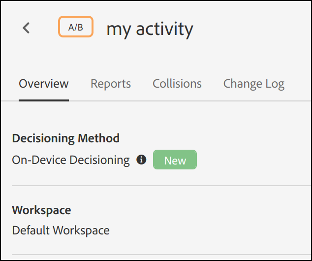

# 裝置上決策概覽

新一代[!DNL Adobe Target] SDK現在提供[!UICONTROL on-device decisioning]，可讓您在伺服器上快取您的A/B和體驗鎖定目標(XT)行銷活動，並在幾乎零延遲的情況下執行記憶體內決策，而不會封鎖對[!DNL Adobe Target]Edge Network的網路要求。

[!DNL Adobe Target]也能透過即時伺服器呼叫，靈活地從您的實驗和ML驅動的個人化行銷活動中，提供最相關和最新的體驗。 換言之，當效能最重要的時候，您可以選擇使用[!UICONTROL on-device decisioning]，但是當需要最相關且最新的體驗時，可以改用伺服器呼叫。 檢視[何時使用裝置上決策與邊緣決策](../../sdk-guides/on-device-decisioning/supported-features.md)，以瞭解有關使用其中一個優先於另一個的使用案例。

>[!NOTE]
>
>裝置上決策可用於使用者端及伺服器端實施。 本文說明伺服器端的[!UICONTROL on-device decisioning]。 如需有關使用者端[!UICONTROL on-device decisioning]的資訊，請參閱使用者端實作檔案[這裡](../../../client-side/atjs/on-device-decisioning/on-device-decisioning.md)。

## 如何運作？

當您安裝及初始化已啟用[!UICONTROL on-device decisioning]的[!DNL Adobe Target] SDK時，會從最靠近伺服器的Akamai CDN下載&#x200B;*規則成品*&#x200B;並快取至伺服器本機。 在您的伺服器端應用程式中提出擷取[!DNL Adobe Target]體驗的請求時，系統會根據快取規則成品中編碼的中繼資料（定義所有[!UICONTROL on-device decisioning] A/B和XT活動），在記憶體中決定要傳回哪些內容。

下圖顯示[!UICONTROL on-device decisioning]架構。 按一下以展開影像。

（按一下影像可展開至完整寬度。）

{zoomable="yes"}

## 有哪些優點？

* **提供幾乎零延遲的決策。**&#x200B;在記憶體和裝置上執行分組和決策，以避免封鎖網路要求。
* **增強應用程式效能。**&#x200B;執行實驗並向您的客戶和使用者提供個人化，而不會損害一般使用者體驗。
* **提升Google網站品質分數。**&#x200B;由於決策是在記憶體中與伺服器端進行，請改善您線上業務的Google網站品質分數，讓消費者更容易發現它。
* **向即時分析學習。**&#x200B;透過[!DNL Adobe Target]或A4T報表即時取得活動績效的深入分析，讓您在關鍵時刻樞紐分析策略。

## 支援的功能

### 活動

裝置上決策支援[表單式體驗撰寫器](https://experienceleague.adobe.com/docs/target/using/experiences/form-experience-composer.html)建立的下列活動型別：

* [!UICONTROL A/B Test]
* [!UICONTROL Experience Targeting] (XT)

### 配置方法

裝置上決策支援下列配置方法：

* 手動

### 對象目標定位

裝置上決策支援下列對象規則：

| 對象規則 | 裝置上決策 |
| --- | --- |
| [地理](https://experienceleague.adobe.com/docs/target/using/audiences/create-audiences/categories-audiences/geo.html) | 是
使用裝置上決策時，支援下列地理屬性：<ul><li>國家/地區</li><li>城市</li><li>緯度</li><li>經度</li></ul> |
| [網路](https://experienceleague.adobe.com/docs/target/using/audiences/create-audiences/categories-audiences/network.html) | 否 |
| [行動](https://experienceleague.adobe.com/docs/target/using/audiences/create-audiences/categories-audiences/mobile.html) | 否 |
| [自訂引數](https://experienceleague.adobe.com/docs/target/using/audiences/create-audiences/categories-audiences/custom-parameters.html) | 是 |
| [作業系統 ](https://experienceleague.adobe.com/docs/target/using/audiences/create-audiences/categories-audiences/operating-system.html) | 是 |
| [網頁](https://experienceleague.adobe.com/docs/target/using/audiences/create-audiences/categories-audiences/site-pages.html) | 是 |
| [瀏覽器](https://experienceleague.adobe.com/docs/target/using/audiences/create-audiences/categories-audiences/browser.html) | 是 |
| [訪客資料](https://experienceleague.adobe.com/docs/target/using/audiences/create-audiences/categories-audiences/visitor-profile.html) | 否 |
| [流量來源](https://experienceleague.adobe.com/docs/target/using/audiences/create-audiences/categories-audiences/traffic-sources.html) | 否 |
| [時間範圍](https://experienceleague.adobe.com/docs/target/using/audiences/create-audiences/categories-audiences/time-frame.html) | 是 |
| [Experience Cloud對象](https://experienceleague.adobe.com/docs/target/using/integrate/mmp.html) (來自Adobe Audience Manager、Adobe Analytics和Adobe Experience Manager的對象 | 否 |

## 我要如何布建使用者端以使用[!UICONTROL on-device decisioning]？

使用[!DNL Adobe Target]伺服器端SDK的所有[!DNL Adobe Target]客戶都可使用裝置上決策。 若要啟用此功能，請在[!DNL Adobe Target] UI中導覽至&#x200B;**[!UICONTROL Administration]** > **[!UICONTROL Implementation]** > **[!UICONTROL Account details]**，然後啟用&#x200B;**[!UICONTROL On-Device Decisioning]**&#x200B;切換按鈕。

>[!NOTE]
>
>您必須擁有管理員或核准者&#x200B;*使用者角色*，才能啟用或停用[!UICONTROL On-Device Decisioning]切換功能。

啟用「裝置上決策」切換後，[!DNL Adobe Target]將開始為您的使用者端產生和傳播&#x200B;*規則成品*。

>[!NOTE]
>
>在初始化[!DNL Adobe Target] SDK以使用[!UICONTROL on-device decisioning]之前，請確定您已啟用切換功能。 規則成品必須先產生並傳播至Akamai CDN，[!UICONTROL on-device decisioning]才能運作。

### 在成品切換中包含所有現有的[!UICONTROL on-device decisioning]個合格活動

當您想要所有符合[!UICONTROL on-device decisioning]資格的即時[!DNL Target]活動自動包含在成品中時，請在&#x200B;**切換此**。

將此切換&#x200B;**保持關閉**&#x200B;表示您需要重新建立並啟動任何[!UICONTROL on-device decisioning]活動，才能將其包含在產生的規則成品中。

## 我如何知道活動具有[!UICONTROL on-device decisioning]功能？

建立活動後，活動詳細資訊頁面中顯示的名為&#x200B;**[!UICONTROL Decisioning Method]**&#x200B;的標籤會指出活動是否具有[!UICONTROL on-device decisioning]功能。

您還可以藉由將欄&#x200B;**[!UICONTROL Decisioning Method]**&#x200B;新增至活動清單，在&#x200B;**[!UICONTROL Activities]**&#x200B;頁面上檢視所有具有[!UICONTROL on-device decisioning]功能的活動。

>[!NOTE]
>
>建立並啟用[!UICONTROL on-device decisioning]功能的活動後，可能需要20分鐘才能納入產生並傳播至Akamai CDN PoP的規則成品中。

## 為確保透過[!DNL Adobe Target]的伺服器端SDK成功傳遞我的[!UICONTROL on-device decisioning]活動，所需遵循的步驟摘要為何？

1. 存取[!DNL Adobe Target] UI並導覽至「**[!UICONTROL Administration]** > **[!UICONTROL Implementation]** > **[!UICONTROL Account details]**」以啟用&#x200B;**[!UICONTROL On-Device Decisioning]**&#x200B;切換。
1. 啟用&#x200B;**[!UICONTROL Include all existing [!UICONTROL on-device decisioning] qualified activities in the artifact]**&#x200B;切換。
1. 建立並啟用[!UICONTROL on-device decisioning]支援的活動型別，並確認該活動的&#x200B;**[!UICONTROL Decisioning Method]**&#x200B;是&#x200B;**[!UICONTROL On-Device Decisioning]**。
1. 使用`decisioningMethod = on-device`安裝並初始化[Node.js](../../node-js/overview.md)或[Java](../../java/overview.md) SDK。
1. 在您的程式碼中實作`getOffers()`或`getAttributes()`以擷取裝置上的體驗。
1. 部署您的程式碼。

如需示範如何開始使用上述步驟1-3的範例，請參閱[快速入門](../getting-started/getting-started.md)區段。

## 其他資源

### 網路研討會影片：利用 [!DNL Adobe Target] 的裝置上決策在零延遲的情況下進行個人化和測試

市場人員、產品擁有者和開發人員被要求在網站、應用程式，以及與客戶連結的任何地方最佳化整體客戶體驗，此情況更勝以往。具有資料獨立單位和複雜實作的多種工具是不夠的。

在這個錄製的網路研討會中，[!DNL Adobe Target]產品專家會討論將關鍵體驗最佳化決策移到裝置上，以便在幾乎無延遲的情況下於本機執行，可以促成令人興奮的新使用案例，同時為客戶改善網站效能。

>[!VIDEO](https://video.tv.adobe.com/v/328148/?quality=12)

### 教學課程：裝置上決策

[!DNL Adobe Target] [!UICONTROL on-device decisioning]啟用幾乎零延遲的內容傳遞。

這段7分鐘的影片：

* 說明[!UICONTROL on-device decisioning]，包括它與[!DNL Target]實作的其他方法的比較
* 示範如何在Target中啟用[!UICONTROL on-device decisioning]
* 檢查已設定JSON內容的表單式撰寫器活動範例
* 顯示Node.JS SDK程式碼範例，其中包含[!UICONTROL on-device decisioning]所需的索引鍵組態
* 在瀏覽器中示範結果

>[!VIDEO](https://video.tv.adobe.com/v/329032/?quality=12)

如需更多影片和教學課程，請參閱[[!DNL Adobe Target] Tutorials](https://experienceleague.adobe.com/docs/target-learn/tutorials/overview.html)。

### Adobe技術部落格 — 第1部分：在Edge平台上執行[!DNL Adobe Target] NodeJS SDK以進行測試和個人化(Akamai Edge工作者)

[按一下這裡以存取部落格](https://medium.com/adobetech/part-1-run-adobe-target-nodejs-sdk-for-experimentation-and-personalization-on-edge-platforms-4d8660964ed9)。

### Adobe 技術部落格 - 第 2 部分：在 Edge 平台上執行 [!DNL Adobe Target] NodeJS SDK 以進行測試和個人化 (AWS Lambda@Edge)

[按一下這裡以存取部落格](https://medium.com/adobetech/part-2-run-adobe-target-nodejs-sdk-for-experimentation-and-personalization-on-edge-platforms-aws-4d6bdac24563)。
