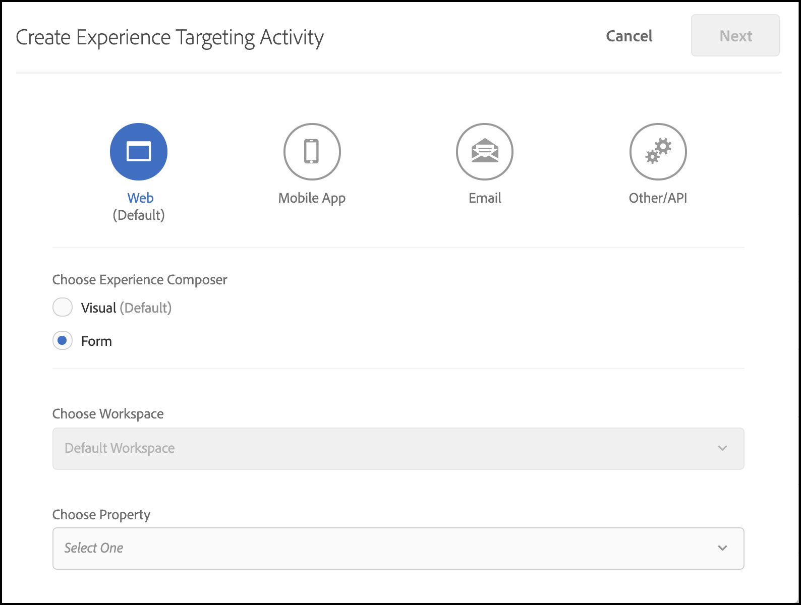

# 疑難排除 [!UICONTROL 裝置上決策]

## 正在驗證設定

### 步驟摘要

1. 確保 `logger` 已設定
1. 確定 [!DNL Target] 已啟用追蹤
1. 驗證 [!UICONTROL 裝置上決策] *規則成品* 已根據定義的輪詢間隔擷取和快取。
1. 透過建立測試來驗證透過快取規則成品的內容傳遞 [!UICONTROL 裝置上決策] 活動（透過表單式體驗撰寫器）。
1. Inspect傳送通知錯誤

## 1.確認已設定記錄器

初始化SDK時，請務必啟用記錄功能。

**Node.js**

若為Node.js SDK a `logger` 應提供物件。

```js {line-numbers="true"}
const CONFIG = {
  client: "<your client code>",
  organizationId: "<your organization ID>",
  logger: console
};
```

**Java SDK**

適用於Java SDK `logRequests` 於 `ClientConfig` 應該啟用。

```js {line-numbers="true"}
ClientConfig config = ClientConfig.builder()
  .client("<your client code>")
  .organizationId("<your organization ID>")
  .logRequests(true)
  .build();
```

此外，JVM啟動時應使用下列命令列引數：

```bash {line-numbers="true"}
java -Dorg.slf4j.simpleLogger.defaultLogLevel=DEBUG ...
```

## 2.確認[!DNL Target]已啟用追蹤

啟用追蹤將會輸出其他資訊，來自 [!DNL Adobe Target] 關於規則成品。

1. 導覽至[!DNL Target]中的UI [!DNL Experience Cloud].

   

1. 瀏覽至 **[!UICONTROL 管理]** > **[!UICONTROL 實施]** 並按一下 **[!UICONTROL 產生新的授權權杖]**.

   

1. 複製新產生的授權權杖到剪貼簿，然後將其新增到您的[!DNL Target]要求：

   **Node.js**

   ```js {line-numbers="true"}
   const request = {
     trace: {
       authorizationToken: "88f1a924-6bc5-4836-8560-2f9c86aeb36b"
     },
     execute: {
       mboxes: [{
         name: "sdk-mbox"
       }]
   }};
   ```

   **Java**

   ```js {line-numbers="true"}
   Trace trace = new Trace()
     .authorizationToken("88f1a924-6bc5-4836-8560-2f9c86aeb36b");
   Context context = new Context()
     .channel(ChannelType.WEB);
   MboxRequest mbox = new MboxRequest()
     .name("sdk-mbox")
     .index(0);
   ExecuteRequest executeRequest = new ExecuteRequest()
     .mboxes(Arrays.asList(mbox));
   
   TargetDeliveryRequest request = TargetDeliveryRequest.builder()
     .trace(trace)
     .context(context)
     .execute(executeRequest)
     .build();
   ```

1. 有了記錄器並追蹤功能，即可啟動應用程式並監視伺服器終端機。 記錄器的下列輸出會確認已擷取規則成品：

   **Node.js SDK**

   ```text {line-numbers="true"}
     AT: LD.ArtifactProvider fetching artifact - https://assets.adobetarget.com/your-client-code/production/v1/rules.json
     AT: LD.ArtifactProvider artifact received - status=200
   ```

## 3.確認 [!UICONTROL 裝置上決策] *規則成品* 已根據定義的輪詢間隔擷取和快取。

1. 等候輪詢間隔的持續時間（預設為5分鐘），並確定SDK正在擷取成品。 將會輸出相同的終端機記錄。

   此外，資訊來自[!DNL Target]追蹤應該輸出到終端機，並附上規則成品的詳細資訊。

   ```text {line-numbers="true"}
   "trace": {
     "clientCode": "your-client-code",
     "artifact": {
       "artifactLocation": "https://assets.adobetarget.com/your-client-code/production/v1/rules.json",
       "pollingInterval": 300000,
       "pollingHalted": false,
       "artifactVersion": "1.0.0",
       "artifactRetrievalCount": 10,
       "artifactLastRetrieved": "2020-09-20T00:09:42.707Z",
       "clientCode": "your-client-code",
       "environment": "production",
       "generatedAt": "2020-09-22T17:17:59.783Z"
     },
   ```

## 4.建立測試，透過快取規則成品驗證內容傳遞 [!UICONTROL 裝置上決策] 活動（透過表單式體驗撰寫器）

1. 導覽至[!DNL Target]Experience Cloud中的UI

   

1. 使用表單式體驗撰寫器建立新的XT活動。

   

1. 輸入mbox名稱，用於[!DNL Target]XT活動的位置要求（請注意，這應為專門用於開發目的的唯一mbox名稱）。

   

1. 將內容變更為HTML選件或JSON選件。 此資訊將會傳回[!DNL Target]向應用程式提出的要求。 將活動的目標定位保留為「所有訪客」，並選取您想要的任何量度。 為活動命名、儲存，然後啟動活動以確保使用的mbox/位置僅供開發。

   

1. 在您的應用程式中，針對在來自您的應用程式的回應中收到的內容，新增記錄陳述式。[!DNL Target]請求

   **Node.js SDK**

   ```js {line-numbers="true"}
   try {
     const response = await targetClient.getOffers({ request });
     console.log('Response: ', response.response.execute.mboxes[0].options[0].content);
   } catch (error) {
     console.error('Something went wrong', error);
   }
   ```

   **Java SDK**

   ```js {line-numbers="true"}
   try {
     Context context = new Context()
       .channel(ChannelType.WEB);
     MboxRequest mbox = new MboxRequest()
       .name("sdk-mbox")
       .index(0);
     ExecuteRequest executeRequest = new ExecuteRequest()
       .mboxes(Arrays.asList(mbox));
   
     TargetDeliveryRequest request = TargetDeliveryRequest.builder()
       .context(context)
       .decisioningMethod(DecisioningMethod.ON_DEVICE)
       .execute(executeRequest)
       .build();
   
       TargetDeliveryResponse response = targetClient.getOffers(request);
     logger.debug("Response: ", response.getResponse().getExecute().getMboxes().get(0).getOptions().get(0).getContent());
   } catch (Exception exception) {
     logger.error("Something went wrong", exception);
   }
   ```

1. 檢閱您終端機中的記錄檔，以確認您的內容正在傳遞，而且已透過伺服器上的規則成品傳遞。 此 `LD.DeciscionProvider` 根據規則成品在裝置上決定活動資格和決策時，會輸出物件。 此外，由於 `content`，您應該會看到 `<div>test</div>` 或者，您已決定建立測試活動時要使用的回應。

   **記錄器輸出**

   ```text {line-numbers="true"}
   AT: LD.DecisionProvider {...}
   AT: Response received {...}
   Response:  <div>test</div>
   ```

## Inspect傳送通知錯誤

使用裝置上決策時，會自動傳送getOffers執行要求的通知。 這些請求會在背景以無訊息方式傳送。 訂閱名為的事件即可檢查任何錯誤 `sendNotificationError`. 以下程式碼範例說明如何使用Node.js SDK訂閱通知錯誤。

```js {line-numbers="true"}
const TargetClient = require("@adobe/target-nodejs-sdk");
let client;

function onSendNotificationError({ notification, error }) {
  console.log(
    `There was an error when sending a notification: ${error.message}`
  );
  console.log(`Notification Payload: ${JSON.stringify(notification, null, 2)}`);
}

async function targetClientReady() {
  const request = {
    context: { channel: "web" },
    execute: {
      mboxes: [{
        name: "a1-serverside-ab",
        index: 1
      }]
    }
  };
  const targetResponse = await client.getOffers({ request });
}

client = TargetClient.create({
  events: {
    clientReady: targetClientReady,
    sendNotificationError: onSendNotificationError
  }
});
```

## 常見疑難排解案例

請務必檢閱 [支援的功能](supported-features.md) 的 [!UICONTROL 裝置上決策] 發生問題時。

### 由於不支援的對象或活動，裝置上決策活動未執行

一個可能發生的常見問題是 [!UICONTROL 裝置上決策] 由於使用中的對象或活動型別不受支援，活動無法執行。

(1)使用記錄器輸出，檢閱回應物件中追蹤屬性的專案。 具體識別行銷活動屬性：

**追蹤輸出**

```text {line-numbers="true"}
  "execute": {
  "mboxes": [
    {
      "name": "your-mbox-name",
      "index": 0,
      "trace": {
        "clientCode": "your-client-code",
        ...
        "campaigns": [],
        ...
      }
    }
```

您會注意到，您嘗試符合資格的活動不在 `campaigns` 屬性，因為對象或活動型別不受支援。 如果活動列在 `campaigns` 屬性，則問題並非由於不支援的對象或活動型別所造成。

(2)此外，找出 `rules.json` 透過檢視 `trace` > `artifact` > `artifactLocation` 在您的記錄器輸出中，並注意您的活動在 `rules` > `mboxes` 屬性：

**記錄器輸出**

```text {line-numbers="true"}
 ...
 rules: {
   mboxes: { },
   views: { }
 }
```

最後，導覽至[!DNL Target]UI並找到相關活動： [experience.adobe.com/target](https://experience.adobe.com/target)

檢閱對象中使用的規則，並確保僅使用上述受支援的規則。 此外，請確定活動型別為A/B或XT。


### 由於對象不合格，裝置上決策活動無法執行

如果裝置上決策活動未執行，但您已驗證rules.json檔案包含該活動，請執行以下步驟：

(1)確認您在應用程式中執行的mbox與活動使用的mbox相同：

>[!BEGINTABS]

>[!TAB rule.json]

```text {line-numbers="true"}
 ...
 rules: {
   mboxes: {
    target-only-node-sdk-mbox: [{ // this mbox name must match the mbox in your request
      ...
    }]
   }
 ...
```

>[!TAB Node.js SDK]

```js {line-numbers="true"}
 const request = {
   trace: {
     authorizationToken: '2dfc1dce-1e58-4e05-bbd6-a6725893d4d6'
   },
   execute: {
     mboxes: [{
       address: getAddress(req),
       name: "target-only-node-sdk-mbox-two" // this mbox name must match the mbox the activity is using
     }]
   }};
```

>[!TAB Java SDK]

```js {line-numbers="true"}
Context context = new Context()
  .channel(ChannelType.WEB);
MboxRequest mbox = new MboxRequest()
  .name("target-only-node-sdk-mbox-two")
  .index(0);
ExecuteRequest executeRequest = new ExecuteRequest()
  .mboxes(Arrays.asList(mbox));

TargetDeliveryRequest request = TargetDeliveryRequest.builder()
  .context(context)
  .decisioningMethod(DecisioningMethod.ON_DEVICE)
  .execute(executeRequest)
  .build();

TargetDeliveryResponse response = targetClient.getOffers(request);
```

>[!ENDTABS]

(2)檢閱「 」，確保您符合活動的對象資格 `matchedRuleConditions` 或 `unmatchedRuleConditions` 追蹤輸出的屬性：

**追蹤輸出**

```text {line-numbers="true"}
...
},
"campaignId": 368564,
"campaignType": "landing",
"matchedSegmentIds": [],
"unmatchedSegmentIds": [
  6188838
      ],
      "matchedRuleConditions": [],
          "unmatchedRuleConditions": [
            {
              "in": [
                "true",
                {
                  "var": "mbox.auth_lc"
                }
              ]
            }
          ]
    ...
```

如果您有不相符的規則條件，便不符合活動的資格，因此不會執行活動。 檢閱對象中的規則，瞭解您為何不符合資格。

### 裝置上決策活動未執行，但原因不明

裝置上決策活動為何無法執行，原因可能並不明顯。 在這種情況下，請按照以下疑難排解步驟來識別問題：

(1)閱讀控制檯中的記錄器追蹤輸出，並識別成品屬性，其外觀將類似於以下內容：

**追蹤輸出**

```text {line-numbers="true"}
...
      "artifact": {
          "artifactLocation": "https://assets.adobetarget.com/your-client-code/production/v1/rules.json",
          "pollingInterval": 300000,
          "pollingHalted": false,
          "artifactVersion": "1.0.0",
          "artifactRetrievalCount": 3,
          "artifactLastRetrieved": "2020-10-16T00:56:27.596Z",
          "clientCode": "adobeinterikleisch",
          "environment": "production"
        },
...
```

檢視 `artifactLastRetrieved` 成品日期並確保您擁有最新的 `rules.json` 檔案已下載至您的應用程式。

(2)尋找 `evaluatedCampaignTargets` 記錄器輸出中的屬性：

**記錄器輸出**

```text {line-numbers="true"}
...
  "evaluatedCampaignTargets": [
      {
        "context": {
          "current_timestamp": 1602812599608,
          "current_time": "0143",
          "current_day": 5,
          "user": {
            "browserType": "unknown",
            "platform": "Unknown",
            "locale": "en",
            "browserVersion": -1
          },
          "page": {
            "url": "localhost:3000/",
            "path": "/",
            "query": "",
            "fragment": "",
            "subdomain": "",
            "domain": "3000",
            "topLevelDomain": "",
            "url_lc": "localhost:3000/",
            "path_lc": "/",
            "query_lc": "",
            "fragment_lc": "",
            "subdomain_lc": "",
            "domain_lc": "3000",
            "topLevelDomain_lc": ""
          },
          "referring": {
            "url": "localhost:3000/",
            "path": "/",
            "query": "",
            "fragment": "",
            "subdomain": "",
            "domain": "3000",
            "topLevelDomain": "",
            "url_lc": "localhost:3000/",
            "path_lc": "/",
            "query_lc": "",
            "fragment_lc": "",
            "subdomain_lc": "",
            "domain_lc": "3000",
            "topLevelDomain_lc": ""
          },
          "geo": {},
          "mbox": {},
          "allocation": 23.79
        },
        "campaignId": 368564,
        "campaignType": "landing",
        "matchedSegmentIds": [],
        "unmatchedSegmentIds": [
          6188838
        ],
        "matchedRuleConditions": [],
        "unmatchedRuleConditions": [
          {
            "in": [
              "true",
              {
                "var": "mbox.auth_lc"
              }
            ]
          }
        ]
...
```

(3)檢閱 `context`， `page`、和 `referring` 資料，以確保如預期般運作，因為這會影響活動的目標定位資格。

(4)檢閱 `campaignId` 以確保評估您預期執行的活動。 此 `campaignId` 將會符合中的活動概觀標籤上的活動ID[!DNL Target]UI：


(5)檢閱 `matchedRuleConditions` 和 `unmatchedRuleConditions` 找出符合指定活動對象規則的問題。

(6)檢閱最新消息 `rules.json` 檔案，以確保包含您要在本機執行的活動。 上述位置在步驟1中參照。

(7)確認您在請求和活動中使用的mbox名稱相同。

(8)確保您使用支援的對象規則和支援的活動型別。

### 即使mbox底下的活動設定在「 」中顯示「符合裝置上決策資格」，仍會進行伺服器呼叫。[!DNL Target]使用者介面

即使裝置符合裝置上決策的資格，仍進行伺服器呼叫的原因有幾個：

* 當用於「符合裝置上決策資格」活動的mbox也用於其他非「符合裝置上決策資格」的活動時，mbox會列在 `remoteMboxes` 中的區段 `rules.json` 成品。 當mbox列於下方時 `remoteMboxes`，任何 `getOffer(s)` 對該mbox的呼叫會導致伺服器呼叫。

* 如果您在工作區/屬性下設定活動，且在設定SDK時未包含相同專案，則可能會導致 `rules.josn` 預設工作區底下的mbox，該檔案可在 `remoteMboxes` 區段。
